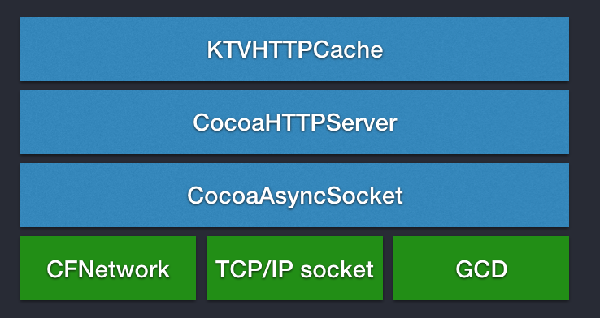
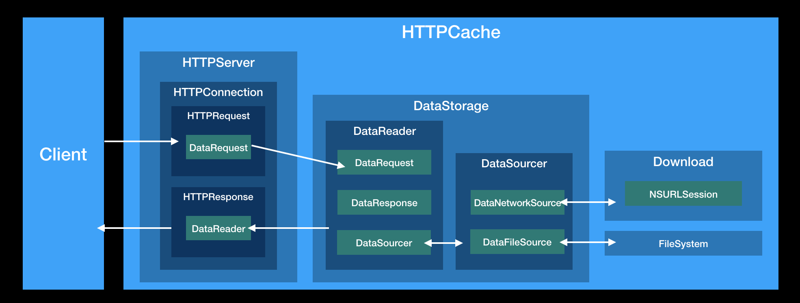
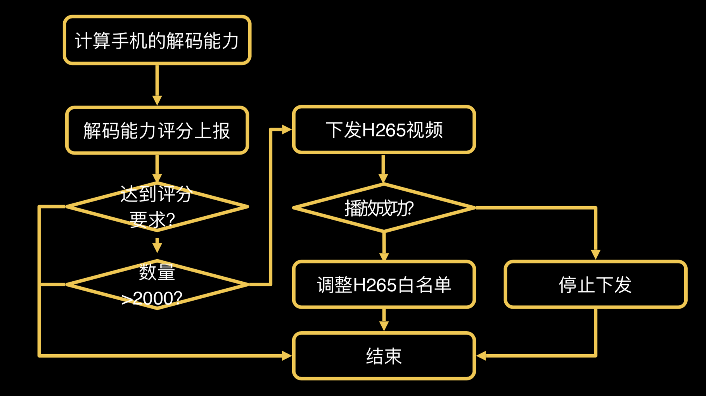
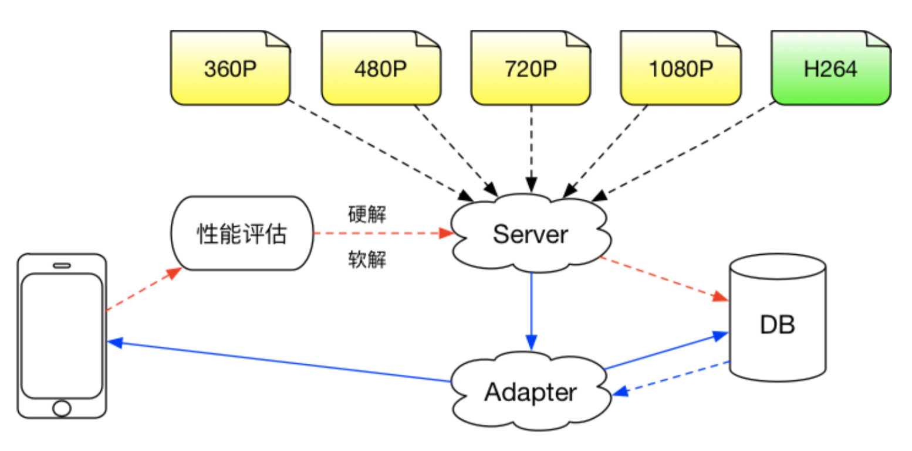

## 视频缓存

对于高频使用短视频的应用，缓存是一种节约流量成本非常有效的方式。其中一个重点在于能够实现边下边播边缓存，避免因为缓存影响第一次播放视频的体验，另外一个重点在于提高缓存的命中率。

在[十亿级视频播放技术优化揭秘][3]一文中，介绍了一种方案：

其核心思想就是将以往播放器直连服务端的方式改为由本地代理服务器中转，这样播放器和服务器之间的数据往来本地代理可以完全把控，这样实现边下边播边缓存自然就很方便了。同时这样的方案可以与底层播放内核解耦，提供更灵活的实现。思路大致如此，接下来主要介绍一下目前在 iOS 平台可直接拿来用的实现方案。

对于 iOS 端代理服务器的实现，可以参考和使用 [CocoaHTTPServer][4]。对于 iOS 端的视频缓存管理，可以参考和使用 [KTVHTTPCache][4]。

[CocoaAsyncSocket][6] 是 CocoaHTTPServer 底层的通信库，CocoaAsyncSocket 是一个可在 iOS 和 Mac OS 平台使用、比较成熟的 TCP/IP socket 库，它基于系统的 CFNetwork 框架、TCP/IP socket、GCD 框架进行封装，提供了对 iOS 开发者友好的接口形式。

CocoaHTTPServer 则是一个可以在 iOS 和 Mac OS 平台使用、轻量级的 HTTP Server 实现。通过 CocoaHTTPServer 我们就可以在我们的应用里面起一个代理来接管服务器与播放器直接的数据流转。

KTVHTTPCache 则是在代理层的基础上来实现对视频数据的下载、缓存和管理。

KTVHTTPCache 的大致结构如上图所示，其中主要包含两个模块：HTTPSever 和 DataStorage。HTTPServer 是基于 CocoaHTTPServer 封装的，负责处理应用内的 HTTP 请求；DataStorage 则负责加载资源和管理缓存，供给 HTTPServer 所需的数据。它的工作流程大致如下（参考[KTVHTTPCache 文档][5]）：

1. 启动 HTTPServer。
2. 当有来自于 Client 的 HTTP 请求时，在 HTTPServer 中首先创建 HTTPConnection 上下文对象，在这个上下文中创建对应的 HTTPRequest 对象，并创建与之绑定的 DataRequest 对象作为对 DataStorage 模块的请求。
3. 同时，在当前的 HTTPConnection 上下文中，创建与 DataRequest 绑定的 HTTPResponse 对象作为对请求的响应。
4. 创建与 DataRequest 绑定的 DataReader 对象作为从 DataStorage 中获取数据的通道。
5. DataReader 分析 DataRequest 来决定是从网络读取数据还是从本地缓存读取数据，并创建网络数据源 DataNetworkSource 和文件数据源 DataFileSource，并通过 DataSourcer 进行管理。
6. DataSourcer 加载数据。
7. DataReader 从 DataSourcer 中读取数据，并交给当前 HTTPConnection 上下文中的 HTTPResponse 处理，最终由 HTTPResponse 将数据供给 Client。

KTVHTTPCache 采取分段缓存的策略。其中有 NetworkSource 和 FileSource 两种用于加载数据的方式，分别用于下载网络数据和读取本地数据。通过分析 DataRequest 的 Range 和本地缓存状态来对应创建。

比如，一次请求的 Range 为 0-999，本地缓存中已有 200-499 和 700-799 两段数据。那么会对应生成 5 个 Source，分别是：

1. DataNetworkSource: 0-199
2. DataFileSource: 200-499
3. DataNetworkSource: 500-699
4. DataFileSource: 700-799
5. DataNetworkSource: 800-999

它们由 DataSourcer 进行管理，对外仅暴露一个 ReadData 的接口，根据当前的 ReadOffset 自行选择向外界提供数据的 Source。

## H.265

H.265 又称作 HEVC（High Efficiency Video Coding），是 ITU-T H.264/MPEG-4 AVC 标准的继任者。H.265 在现有的 H.264 标准的基础上加以改进，使用先进的技术改善码流、编码质量、延时和算法复杂度之间的关系，达到最优设置。理论上，H.265 比 H.264 压缩效率提高 30%-50%。但是，与此同时，H.265 相对 H.264 的编码时间更长，约为 3-7 倍，解码复杂度也提高了 4 倍，更加消耗系统资源，本质上是拿时间换空间。

如果要在客户端上使用 H.265 编码基本上是不可行的，目前尚无硬件能够支持 H.265 编码加速，耗时过长。所以 H.265 编码只有放在服务端去做。

在客户端上使用 H.265 解码是可行的，使用软解相对 H.264 的耗时基本差别不大，但是对 CPU 的占用会比较高，会造成设备过热以及卡顿。目前支持 H.265 硬解的设备逐渐多了起来，在设备上使用 H.265 硬解是一种很不错的选择，可以在 CPU 占用较低的情况下来节省带宽。

在[十亿级视频播放技术优化揭秘][3]一文中，介绍了腾讯 QQ 空间产品中使用 H.265 解码的策略：在合适时机，运行 1 次大规模的浮点数运算来评估当前机器的解码性能，并将评分结果上传后台服务器进行云适配。

从 iOS 11 系统开始，系统将通过 VideoToolbox 来支持 HEVC 编解码，在新的 iOS 设备上也支持硬编硬解。

参考：

- [基于 iOS11 的 HEVC(H.265) 硬编码/硬解码功能开发指南][7]。

[SamirChen]: http://www.samirchen.com "SamirChen"
[1]: {{ page.url }} ({{ page.title }})
[2]: http://www.samirchen.com/video-playback-bandwidth-cost
[3]: https://mp.weixin.qq.com/s?__biz=MjM5MDE0Mjc4MA==&mid=2650997049&idx=1&sn=079d954687944e74778df58f31078bd3&chksm=bdbef96a8ac9707cd094f3737f6a32ce849066f50857b0b260fc2804e2eda22d3f6452b3cbfa&scene=27#wechat_redirect
[4]: https://github.com/robbiehanson/CocoaHTTPServer
[5]: https://github.com/ChangbaDevs/KTVHTTPCache
[6]: https://github.com/robbiehanson/CocoaAsyncSocket
[7]: https://www.jianshu.com/p/cb93e618e041
