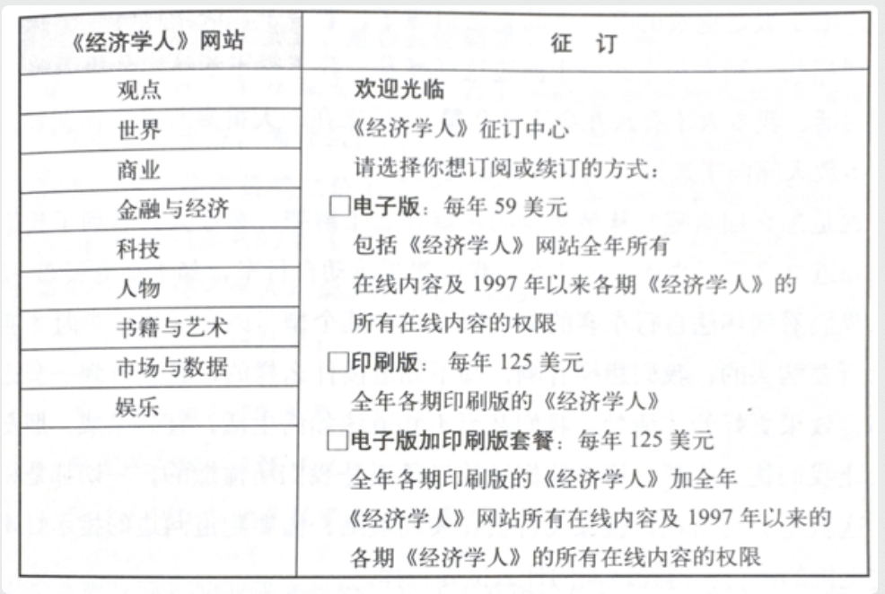
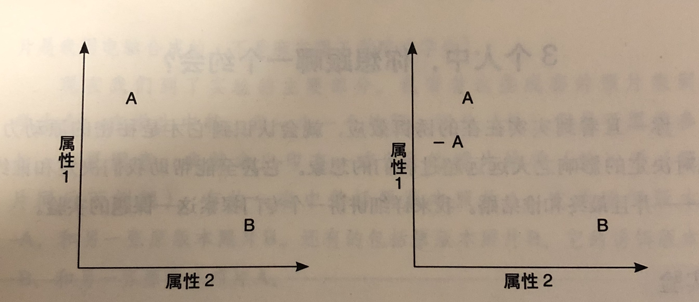

## 第一章：为什么我们喜欢比较和攀比？ 

### 比较

人们很少做不加对比的选择。

我们总是靠观察周围的事物以确定彼此的关系。

> 案例：
> 
> 驱动你选择「电子版加印刷版套餐」。「印刷版」是这种驱动的诱饵。

 

> 案例：
> 人们一般不会点菜单上价格最高的菜，但他们很可能点排第二位的。

人脑思维所受的束缚：我们总靠观察周围的事物以确定彼此的关系。我们无法不这样。我们不但喜欢拿事物与事物作比较，还喜欢把容易比较的事物集中作比较，避免把不容易比较的事物作比较。

> 案例：有 3 处房子，一幢是现代风格，另两幢是老式风格，价格差不多，都很合意。唯一的差别是老式房子中的一幢（诱饵）屋顶需要换，你选哪幢？
> 通常，我们很可能会选那幢不需要换屋顶的老式房子。在这个决定过程中，我们现代风格的房子一无所知（甚至没有另一幢和它作比较），于是它被放到一边了。不过我们确切的知道老式房子中，不换屋顶的比要换屋顶的那幢要好。于是我们决定买那幢不换屋顶的。

所以，在上图中，把 -A（诱饵）放进来，建构出与 A 的一种简单、直观的比较关系，由此使 A 看来较优，不仅相对于 -A，相对于 B，也会让我们以为 A 不仅比 -A 好，也比 B 好。结果就是，把 -A 加到场景中，即使根本没人选择它，但它会使人们更可能最终选择 A。

> 案例：
> 面包机卖不出去，再推出一个个头更大、价格更高的新型号的面包机。

 

> 案例：
> 出去择偶，带上一个外观特点和你类似（相似的肤色、体型、面貌），但要比你稍稍差一点（-你）。

 

> 案例：
> 如果每个人的工资都被大家知道了，那就是灾难。除了那个薪水最高的人，所有人都会觉得工资太低。

 

> 案例：
> 买 25 美元的钢笔，走 15 分钟去另一家店便宜 7 美元，你很可能会去。买 455 美元的西服，走 15 分钟去另一家店便宜 7 美元，你很可能不去。

我们真正应该考虑的问题是：花 15 分钟省 7 美元是否值得。而要避免被套进这 7 美元是从 25 美元里省的还是从 455 美元里省的相对论圈套里。

## 第二章：供求关系失衡：为什么珍珠无价？

### 锚定

> 案例：
> 曾经的黑珍珠无人问津，后来被宝石商人放到珠宝店铺的橱窗里展示，表上令人难以置信的高价，在广告里，以钻石、红宝石、绿宝石作为映衬，做了这样的「锚定」后，曾经不知价值几何的东西，现在被捧成了稀世珍宝。

就像幼鹅会深深依赖第一眼看到的生物一样，人们的第一印象和决定也会成为「印记」。我们一旦以某一价格买了某一产品，我们也就为这一价格所「锚定」。

当我们购买一件产品，首次的价格大都是任意的，并可能受到任意问题答案的影响；可是一旦这些价格在我们的大脑中得到确立，它形成的便不仅是我们对某一产品的出价意愿，还包括我们对其他相关产品的出价意愿。比如，我们以某一价格买了一款普通键盘，这个价格的锚定很可能会影响到我们买一款机械键盘，甚至是买一款鼠标的出价意愿。

不过价格标签本身并不是锚。它们在我们深入考虑后，想用某一特定价格购买某一产品或服务时才可以成为锚。这就是印记的形成。从此以后，我们愿意接受的一系列价格总是需要参照原先的锚来决定。因此，第一个锚不仅影响我们当时的购买决定，而且影响后来的许多决定。

> 案例：
> 人们从物价水平低的地区搬到中等水平城市时并不随之增加消费以适应当地水平。同样，从高物价城市搬来的人却总花费和在原住城市相等的钱买房子。

我们会把自己锚定在初次价格上，并且这个锚具有持续效应，我们很难做到从一个锚定价格跳到另外一个。最初的决定会跟随后相当长时间里的决定产生共振效应。第一印象非常重要。

过去我们遇到的任意的锚在形成初次决定之后，仍会长久存在，伴随我们左右。

### 羊群效应

既然锚定效果的影响这么长久，那么重要的就是要**弄清楚将最初决定转化为长期习惯的过程。**

其中一个需要了解的概念是「羊群效应」，基于其他人的行为来推断某事物的好坏，以决定我们是否仿效。

此外，还有「自我羊群效应」，这主要发生在我们基于自己先前的行为而推想某事物好或不好。

> 自我羊群效应案例：
> 第一次进星巴克后，给你的体验不错，下一次又想喝咖啡时，在面临星巴克和其他选择时，之前去过星巴克的体验让你更倾向于再次去星巴克，你已经加入了自我羊群。而此后，你会一次又一次的走进去，于是到星巴克喝咖啡成了你的习惯。在后续的消费中，消费价格等级提升也是如此。
> 接下来就有一个问题了：为什么我们会锚定星巴克，甚至从被锚定邓肯甜甜圈等其他店，把锚转移到星巴克？
> 星巴克的创始人尽一切努力独树一帜，使得星巴克与其他咖啡店不同---不是从价格上，而是从品味上。这样你在价格上的锚，就能被品味上的锚所替代。

### 非理性的供求关系

> 案例：
> 汤姆把粉刷波利阿姨的篱笆变成一种特权活动来吸引他的小伙伴，把负面体验转变成了正面的。
> 英国一些阔绰的绅士夏季每天要花掉不少钱来驾着马车在大路上跑来作为消遣，如果付钱雇他们驾车载客，他们是不愿意干的。

这些案例中，锚是放在了对一件事情的定义上，这告诉我们：**我们所作的许多决定不论是不经意的还是经过深思熟虑的，锚都在其中起作用。而不是仅仅基于自己的基本价值判断---喜欢或不喜欢。**

当理解了这种非理性，我们再去看消费中的供求关系，我们会发现：**市场的供求关系不是基于偏好，而是基于记忆。**

> 假设：
> 如果明天酒价降低 50%，奶价上涨 100%，你认为消费会受到什么影响？但如果人们对从前的酒价和奶价都不记得，那又会怎样？

**我们对价格的敏感度，事实上很大程度上可能是两种因素共同作用的结果：1）我们对过去价格的记忆；2）我们想与过去决定（锚）保持一致的欲望。而根本不是真正偏好或需求大小的反映。**

## 第三章：免费的代价：为什么赠品反而让我们花费更多？

免费引起的情绪冲动几乎是不可战胜的。零造成的价格效应非常特别，这是其他数字无法比拟的。

> 实验：
> 两种商品 A 和 B，售价 10 元和 2 元。分别降价到 9 元和 1 元，几乎销量占比没啥影响。分别降价到 8 元和 0 元（免费），则 B 的销量将大增。

免费到底为什么如此诱人？一种解释是，多数交易都有有利的一面和不利的一面，但免费使我们忘记了不利的一面。免费给我们造成一种情绪冲动，让我们误认为免费物品大大高于它的真正价值。为什么？我认为是由于人类本能地惧怕损失。免费的真正诱惑力是与这种惧怕心理联系在一起的。我们选择某一物品不会有显而易见的损失。但是假如我们选择的物品不是免费的，那就会有风险，可能作出错误决定，可能蒙受损失。于是，如果让我们选择，我们就尽量朝免费的方向去找。

免费的吸引力不仅仅局限于现金交易，对物物交换也是一样。

免费不仅仅是一种折扣，它和折扣完全是两回事。2 美分和 1 美分的差别微不足道，1 美分和 0 美分之间却如歌霄壤。

## 第四章：社会规范的成本：为什么白干活高兴，干活赚钱反而不高兴？

[SamirChen]: http://www.samirchen.com "SamirChen"
[1]: {{ page.url }} ({{ page.title }})
[2]: http://samirchen.com/rn-predictably-irrational/