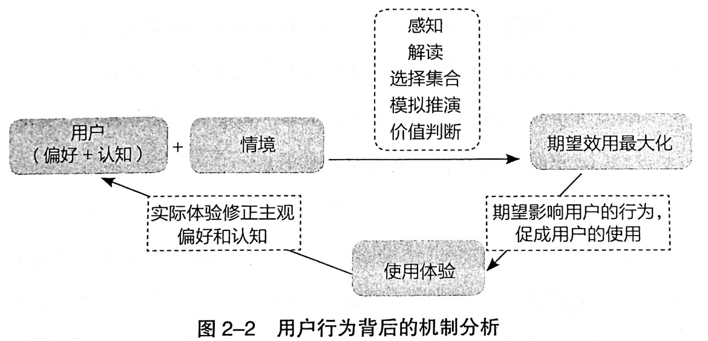

《俞军产品方法论》不是一本容易读完的书，因为里面有太多抽象的概念和定义，难免让人觉得枯燥。但是如果能耐着性子看进去，也许会发现这确实是一本能称为「方法论」的书。

作者在书中指出产品经理应该「掌握一个领域的用户模型」，并进阶去「设计交易模型」。那怎么去做呢？作者结合自己的认知和思考，用极强的抽象能力，为我们总结出至少两条方法论工具来辅助日常的思考和分析：

- 1）在用户模型分析场景：**用户价值 = 新体验 - 旧体验 - 替换成本**
- 2）在交易模型分析场景：**相对价格 = (直接成本 + 交易成本) ÷ 效用组合**

但是看到这两条公式我们却也很难上手直接用，因为首先得理解清楚例如「用户价值」、「交易成本」、「效用组合」这些公式中列出的概念。所以，全书相当大的篇幅是在阐述这两条方法论相关的理论和概念，以解释其原理和用法。

我们可能还会感到困惑的是：就算理解清楚了这些方法论，它的价值何在，对我们有啥用呢？对于这个问题，本书附录张亮写的《俞军的一堂产品课》一文中有做回答：

>**首先，它是个可以用于判断的标准。**用户价值在立项初期可以反复推敲：你的产品就是新体验，你瞄准的旧体验是什么？如果给旧体验打个分，再给新体验打个分，大概各是多少？替换成本，比如价格、时间、心理成本、生理成本，分别大概是怎样的，这些都是可以估算的。看看眼前的例子，如苹果手机之于诺基亚，微信之于短信，滴滴之于路边招手打车，效果不言自明。

>**其次，它有助于引导思考。**能不能找到旧体验接近于零的用户群？什么时候用户的旧体验接近于零？其实就是世界发生某种巨变时，或用行业常用词来说就是「人口红利」出现时。俞军自己倾向于用「有新的生产要素出现」，那些堪称改变世界的生产要素，比如电、流水线、汽车、互联网、移动互联网…… 过去几年我们见证了移动互联网巨大的人口红利，这是超大的浪潮。有时候新生产要素的影响可能没那么显著，比如最近两年内容付费的兴起和直播业的兴起，俞军认为这首先是因为移动支付的成熟。想做大产品，必须善用新生产要素。你的产品有没有借力于新生产要素下的用户体验跃迁？这是很明确的一个问题。

>**最后，它有助于行动。**毕竟一家公司不是每天每个人都在找新方向的，多数人在做什么？围绕替换成本做文章。将用户从别的产品拉到你这里，需要你的替换成本足够低，阻止用户从你的产品去到别的产品，需要你的替换成本足够高，这两件事其实是一件事。

接下来，我还是从几个问题出发来梳理一下书中的部分内容和我的理解，小记在这里。

## 1、产品经理是做什么的？

产品经理的四大工作职能：「需求（定义产品）」、「生产」、「销售」、「协调」。

**「掌握一个领域的用户模型」是产品经理的合格线，「设计交易模型」是产品经理的进阶之路。**

用户模型，即产品用户或潜在用户的偏好和行为反应模型。产品经理要以异质性、情境性、可塑性、自利性、有限理性的用户行为为基本单位来研究用户行为及其背后的原理。产品经理要能较准确的预判产品迭代后的用户行为变化。

交易模型，以交易为基本单位来研究产品，目标是建立可持续交易的互惠模型。产品每增加一个属性调整一个功能都是在调整效用组合，属于交易模型的范畴。

产品经理接触的对象有「产品」、「用户」和「企业」。

## 2、产品、用户、企业三者的关系是什么？

**产品是企业和用户进行价值交换的媒介。**

用户愿意进行交易（选择该产品）是因为这个选择对他而言是价值最大化的：

- 1）主观预期该产品的效用大于用户的成本；
- 2）主观预期该产品的效用大于其他产品的效用（机会成本）。

企业愿意进行交易（卖出产品）是因为这么做最有利可图。并且企业要注意持续维护和创造用户价值，才能保证交易的可持续性，从而持续获利。因此，企业的一切行为，也应该围绕「让交换行为更多地发生」。

## 3、如何理解用户？

**用户不是自然人，而是需求的集合。**（这个说法是不是和马克思说的「人的本质是一切社会关系的总和」有异曲同工之妙）

怎么理解呢？一个自然人可以分别是成百上千种产品的成百上千个用户。拿微信举例，假如通信功能的用户是 11 亿，微信支付的用户是 3 亿，公众号的用户是 5 亿，按需求来算，微信的用户就不是一般统计意义上的 11 亿了，而是超过 11 亿。

如果一定要说产品经理研究的是人，那也要从四个维度去研究：「生物的人」、「社会的人」、「认知的人」、「情境的人」。

### 3.1、用户有哪些属性？

用户的五个属性：「异质性」、「情境性」、「可塑性」、「自利性」、「有限理性」。

- 异质性：用户的偏好、认知、所拥有的资源不一样，特点千差万别。
- 情境性：用户的行为受情境影响。（道理类似张小龙说的：人是环境的反应器。）
- 可塑性：用户的偏好和认知会随着外界不同的信息刺激发生变化和演化。（例如砸钱补贴培养用户手机打车的习惯。）
- 自利性：用户追求个人总效用最大化。
- 有限理性：用户虽然追求理性，但能力有限，其判断经常出错也经常被骗。

### 3.2、怎么理解用户行为机制？

用户行为背后的机制如图所示：

在不同的情境下用户的偏好会塑造用户的期望效用，塑造的过程大概会经过「感知」、「解读」、「选择集合」、「模拟推演」、「价值判断」五个阶段。在一次期望效用的塑造中，有些过程可能会被跳过（直接由大脑的本能、习惯、直觉做出决策），这个期望效用的塑造过程会受到各种认知偏误的影响。期望效用影响用户的行为和选择，促成了用户的行为。用户的实际使用体验会形成经验，反馈给用户的偏好，对其进行修正或强化，形成新的偏好。

**要促成用户的行为，最有效的方法是「选择偏好和认知合适的用户」；如果不合适，则要「针对情境五步做详细的设计，促使用户的期望效用最大化，从而完成某行为」。**

### 3.3、如何定义用户价值？

对用户来说，价值由主观效用决定。效用是欲望满足的程度。效用的最大特点是主观性，所以价值也是一种主观判断。因此，产品的用户价值是一种主观属性，是由买方（或使用者）的主观效用评价来定义的。

用户价值（即主观效用）具备「认知依存」、「情境依存」、「经验反馈演化」三个特性：

- 用户的认知决定了他的偏好。
- 有情境才有用户，脱离情境就没用用户。
- 用户价值具有经验反馈演化的特性，是变化的，用户是变化的，产品也要跟着变化，演化的结果是相对价格的变化。

具体到产品里面可以用一个公式来衡量用户价值：

**用户价值 = 新体验 - 旧体验 - 替换成本**

## 4、如何理解产品？

**产品是一个交换媒介，企业用产品和用户交换价值。**

一个好的产品要有三个属性：「对用户有效用」、「让企业有收益」、「可持续」。

这三者，「有效用」强调了「用户价值」，「有收益」强调了「商业价值」，「可持续」则强调了「用户价值和商业价值的权衡统一」。

那如何区分用户价值和商业价值呢？这时候就要从「交易」的角度来理解产品，认识到交易模型的概念。交易不仅是指钱，还有用户付出的时间、身体和心理成本、个人数据、投票支持、未来承诺等。所以，用户的一次行为就是一次交易。因此，前文说产品经理的进阶之路是设计产品的交易模型。

## 5、如何理解企业？

**企业的本质只在于两点：发现市场获利机会和生产效率高于市场。**

企业发现市场获利机会的途径有三种：「洞察」、「试错」、「偶然性」。

企业建立科层制，通过权威来配置企业资源，组织实现更有效率的生产（提供物品或服务），效率必须高于市场。

影响组织效率的点有：「共同目标」、「共同理念」、「共同知识」、「运行机制」，这四点不是互相孤立的，而是相互影响的。

企业做产品一般有四个方面的产出：「财务绩效」、「认知」、「团队」、「无形资产」。后三者是仅做财务投资无法获得的。

**企业用产品和用户交换价值。企业的一切行为，也应该围绕「让交换行为更多地发生」。**

## 6、如何理解交易？

**世界无时无刻不在发生交易的原因是：交易创造价值。**

**世界上没有等价交换**，因为只要不存在强迫和欺诈，一定是双方都主观判断自己会受益，才会完成交易，如果有一方亏本，他就不会愿意进行交易。从另一个角度来看，也是因为交换是需要交易成本的。

产品即交易，从用户视角来讲，用户的每一次主动行为都是与世界的一次交易。作为产品经理，就要帮助用户创造这样的交换，产品设计要以终为始，一开始就奔着最后能成交去设计。

交易模型则是指产品经理发现和设计的合理机制，它能促成用户做出某种行为（即交易），且可持续（生态是平衡的）。交易模型在某种意义上也是商业模式，是多边关系平衡的利益创造和利益分配模式。

理解交易模型其实有很多有意思的切入点，比如：「损失厌恶」、「选择增加福利」、「激励相容」。

产品的最终目的是促成用户的交易行为，企业的一切行为也应该围绕「让交易行为更多地发生」，有这些做法：

- 1）持续发现和追加可交换的、有利可图的用户价值。
- 2）创造和更高效率地创造这些用户价值。
- 3）持续降低生产成本和所有交易成本。
- 4）企业行为的权重，按影响用户交换行为的 ROI 排序。
- 5）维护企业生存能力和可持续发展能力。

交易是经济学里的概念，产品经理要理解交易，对经济学中与之相关的知识要有所涉猎，其中较为基础的需要掌握：「效用」、「边际」、「成本」、「供需定律」。

### 6.1、什么是效用？

** 效用是欲望的满足程度，人通过消费物品和劳务来满足欲望。**

跟效用相关的两条原理：

- 1）边际效用递减原理：一个人对于财富的占有多多益善，即效用函数一阶导数大于零；随着财富的增加，满足程度的增加速度不断下降，效用函数二阶导数小于零。
- 2）最大效用原理：在风险和不确定条件下，个人的决策行为准则是为了获得最大期望效用值而非最大期望金额值。

效用是多样的，包括但不限于货币、时间、身体需求、心理需求、信念、情绪、认知等。这些就包含了大部分的用户需求起源。

产品效用对用户需求的满足程度大体可以分为四类：「底线需求（不能低于）」，「够用就好（不用高于）」，「越多越好（愿意多支付）」，「惊喜（超过预期或参照系）」。

产品的功能和属性本身都只是交换媒介，用户从产品获得和感知的，只是一组效用，且对这些效用的评估有个体差异和情境差异。所以，从这个角度来看产品是一组约束条件下的一个效用组合。

所以分析产品的用户价值时，我们不要把产品当成一个整体来看，而是要拆成用户视角中的各种效用，然后来分析各种产品属性迭代对一个（或一组）效用可能的影响，进而分析预判这个效用变化对应的用户行为变化。

### 6.2、怎么理解边际的概念？

边际也是理解交易模型时必不可少的概念。在产品语境下需要理解的边际概念，包括：「边际效用」、「边际效用递减」、「边际成本」和「边际利润」。

传统经济学里，边际效用是指消费者对某种物品的消费量每增加一单位所增加的额外满足程度。边际的含义是额外增量。

假如你连续吃了6个苹果，每次多吃的一个苹果，就是边际增量。你吃第一个苹果时很开心，但当吃到第六个苹果时，你可能就不会那么开心了，可能是因为吃撑了，也可能是因为你对这个味道感觉腻烦了。这种情况，我们便说吃苹果带来的边际效用递减了。

认识边际成本对企业而言极为重要。比如制造业企业，其生产的时候一开始有规模效应，边际成本是逐步降低的。但到了某一个临界点后，其边际成本反而有可能会变高。互联网产品的拉新费用其实也有类似的边际效应。互联网获客成本最低的时候是移动互联网刚开始兴起的时候，那时获得一个用户也许就几元钱，越往后获取的是越难转化的用户（潜在交易成本更高，转化需要的难度和成本更大）。

边际利润是指在一个给定约束条件下，再多做一笔交易，增加的额外利润。

### 6.3、成本包含哪些？

成本，从不同角度，可以分为「机会成本」、「交易成本」、「边际成本」、「固定成本」、「可变成本」、「沉没成本」、「平均成本」、「会计成本」等很多种，我们主要论述交易成本。

**交易成本，指完成一笔交易时，交易双方在买卖前后所产生的各种与此交易相关的成本。**

企业和用户以产品为媒介交换价值，在这个交换中，交易成本的本质是：**所有用户（买方）付出的但企业（卖方）没收到的成本，以及所有企业（卖方）付出但用户（买方）没收到的成本。**

产品经理要关注交易成本，因为有交易才有用户，创造用户就要创造交易，即促成潜在交易。企业的日常职能是交换：选择合适的用户价值，更高效率地生产，降低交易成本，更多促成与用户交换，可持续地创造交易，并使企业和用户双方可持续地获益。

从产品角度，我们可以把交易成本的来源概括为：「信息不对称」，「信息不确定」，「信息不完整」和「信息有成本」。

交易成本在传统上有三类：市场型交易成本（买卖交易），管理型交易成本（组织内管理交易）与政治型交易成本。产品经理只有在市场经济环境中才能发挥较大作用，所以主要关注的是市场型交易成本。

市场型交易成本主要分为以下三类：

- 1）搜寻（商品和交易对象）成本和度量（交易对象和商品的属性）成本；
- 2）寻价（议价比价）成本和决策（决策和订立契约）成本；
- 3）实施成本和保障（权利、违约、意外、监督等）成本。

### 6.4、如何理解供需定律？

供需定律是描述市场供需和价格变化的基本规律，当需求大于供给时，价格上升，当需求小于供给时，价格下降。在实践中最常用的表述是：在其他条件不变时，价格下降，需求上升。

我们从供需定律演化出方便产品经理分析产品的工具，人间第一定律：**其他条件不变时，相对价格降低，需求量上升。**

**相对价格 = (直接成本 + 交易成本) ÷ 效用组合**

它跟需求定律的区别，一是把价格（支付的代价）明确地细分成了直接成本和各类交易成本，二是把「默认不变的商品」这个抽象概念明确地定义成了用户视角的产品效用组合，也就是把「在其他条件不变时」经常变化的「产品变化」也考虑进来。

站在用户角度，只要产品的效用组合增加，产品的相对价格就降低；直接成本降低或交易成本降低，产品的相对价格也降低。而产品的相对价格降低，用户的需求量必然上升。这个相对价格公式，与用户价值公式一起，可以作为产品经理的两个日常分析工具。

**在蓝海时代，一个革命性的新技术被应用到新产品时，可能新创造出很大的效用组合，于是相对价格大幅降低，需求量就大幅上升，产品用户规模快速增长。然后，产品发展过程中，每降低一些交易成本，就能转化一些用户。**

**在红海时代，比较适合用这个人间第一定律去分析产品。可以通过追加效用组合、改变效用组合或降低各类交易成本来降低产品的相对价格，实现用户增长。**

[SamirChen]: http://www.samirchen.com "SamirChen"
<!-- [1]: {{ page.url }} ({{ page.title }}) -->
[2]: http://samirchen.com/rn-the-product-methodology-of-yujun
