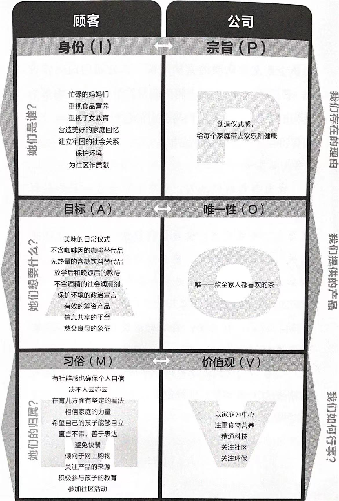
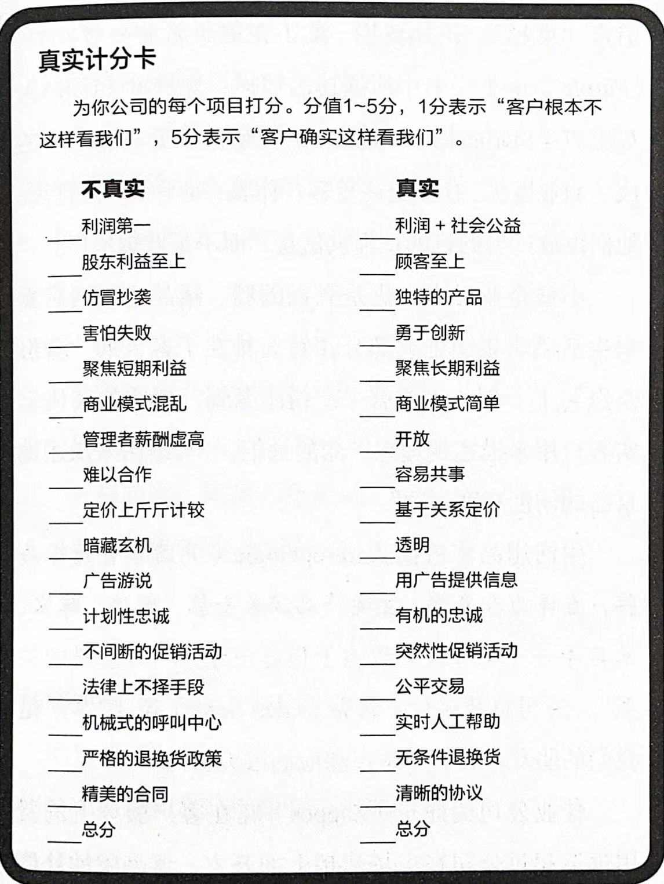
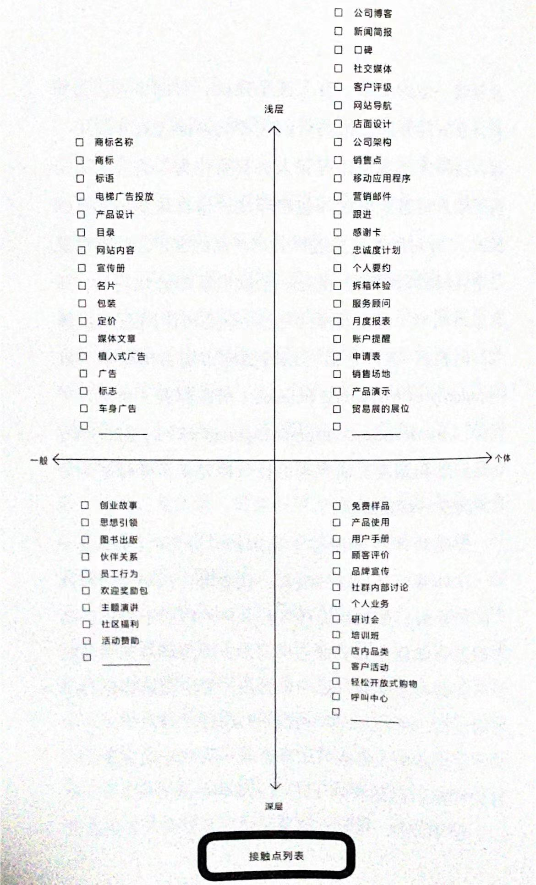
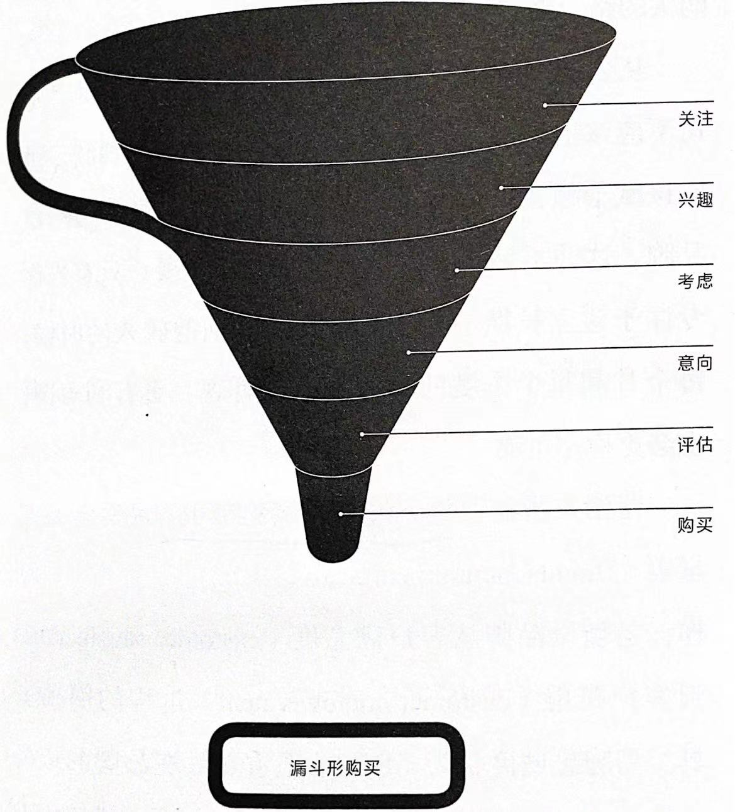
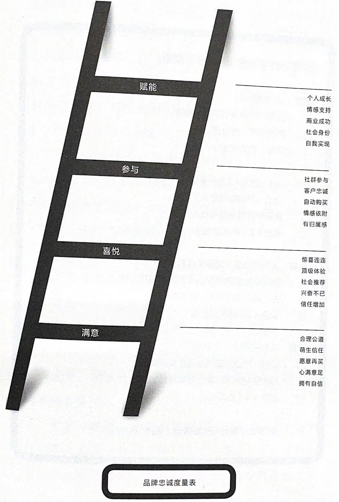

## 1、这本书在写啥？

随着技术的突飞猛进，连接性的爆炸式增长，以及其为客户提供的能量，在商业活动中，品牌构建的核心问题已经发生了改变：从『如何将商业战略和客户体验结合起来』演变为『如何为那些推动你成功的客户赋能』。

旧的品牌模式以工厂管理的逻辑为基础：公司（通过产品和广告）创造品牌，品牌吸引（作为被动受众的）客户，客户（通过重复购买）维系公司的发展。

新的品牌模式发生了『翻转』：公司（通过产品和社交媒体）先创造客户，再借由客户（购买和宣传）创造品牌，品牌（通过客户的忠诚）维系公司的发展。

拥有品牌的不是公司，而是那些从品牌中获得意义的客户。你的品牌，你说什么不重要，客户怎么看待才重要。

作者对『品牌构建模式发生了翻转』的洞察便是这本书的内核，以此为出发点，介绍了更多细分的翻转形式，有的还介绍了具体的操作工具。这些内容或许对我们跳出旧的思维模式，在新的环境下用新的思维方式思考品牌构建的方法会有帮助。

## 2、商业环境变化给品牌构建带来了哪些新的现实处境？

1）『权利』已经从公司转移到了顾客手中；

2）人们关注的不再是产品而是『意义』；

3）顾客通过购买商品建立『身份』；

4）顾客讨厌被出卖，却钟情于购买；

5）顾客在『社群』中消费，这让他们感到安全，并拥有成就感；

6）当下的竞争不再是公司之间的竞争，而是社群之间的竞争；

7）那些拥有最强大社群的公司将在竞争中胜出；

8）社群之间通过『技术』相互连接；

9）品牌应该具备在不同技术之间『流动』的能力；

10）最成功的品牌都不是静止不动的，而是『变动不居』的。

## 3、市场营销的关注点发生了哪些变化？对应这些变化，我们要怎样重新定义『品牌』？

市场营销的关注点的变化：产品本身 → 产品的功能 → 产品带给人们的感受 → 产品带给人们的意义。

与之对应的品牌的定义，我们检视了：

- 品牌就是商标。
- 品牌是一种产品。
- 品牌是所有印象的总和。
- 品牌是一种承诺。
- 品牌是一种关系。
- 品牌就是一种名声。

最终选择了这个定义：

**品牌是顾客对某个产品、某种服务或某家公司的直觉。**

## 4、在销售中要怎么翻转？

**从『销售』向『参与』翻转。**

『传统营销』更注重销售产品，它乐见品牌给销售带来的光环，更注重短期业绩，却不关心品牌的长期成长。

『品牌构建』则认为随着时间的推移，客户将变得更有价值，这种价值远胜于一次性的交易。公司应该销售产品，但消费者也应该加入到品牌中来。顾客们讨厌被当成销售目标，而更愿意和那些视顾客为活生生的人都公司做生意。品牌构建的飞轮效应可以带来更持久的成功，并给公司带来更强大的战略优势：**客户的忠诚**。

任何争取客户的努力都是**营销**，而任何争取客户并试图留住客户的努力都是**品牌构建**。

>忠诚的力量：
>更换品牌之前，50% 最忠诚的顾客已经支付了 25% 的溢价。
>与新顾客相比，忠诚的老顾客多支出 33%。
>新客户购买的概率只有 5%～20%，而现有客户复购的概率则高达 60%～70%。
>那些与公司存在情感联系的客户与该公司做生意的概率是其他人群的 4 倍。
>在许多类别中，最忠实的那 10% 的客户创造了 50% 的收入。
>在某些行业，忠诚度每提高 2% 就相当于成本降低 10%。
>客户留存率每提高 5% 就意味着利润提高 30%。
>顾客忠诚度每提高 5% 就意味着针对每位顾客一生的利润提高 95%。

## 5、在看待用户时要怎么翻转？

**从『公司身份』向『客户身份』翻转。**

在以客户为中心的市场中，『我们是谁』远没有『他们是谁』来得重要，建立品牌的秘诀是『客户身份』，而不是公司身份。我们需要帮用户成为他们想成为的人。他们做出的每一个选择、购买的每一件产品都在塑造他们的身份。

我们应该设计一个框架，让客户得以认知他们自己，建立他们的独特身份，并最终成就他们自己的人生。

## 6、在制定市场策略时要怎么翻转？

**从『客户细分』向『客户社群』翻转。**

客户细分是针对现有市场的一种简便策略，是把一个庞大的市场根据地理、人口统计、心理图形、行为方式或利益偏好等类别将其分割成更小的部分，提供针对性的产品，分而治之。

但是在互联网时代，用户能够通过网络跨越边界（无论是地理、人口、心理还是其他方面的边界）形成群体。

在这个很容易形成圈子的时代，衡量的基本单位不再是细分的市场，而是用户所形成的『社群』。社群是指一群不仅拥有共同兴趣，而且拥有共同信息的人。社群不仅仅是另一种类型的细分。你无法以社群为营销目标，你能做的是支持它，助力它成长，与其成为伙伴，使其井然有序。研究表明，愿意在品牌社区中与其他客户进行互动的客户，往往会对品牌以及其他客户产生强烈的忠诚感。

社群也有局内人和局外人之分。你可以扩充一个社群，却不能打破它的规则。了解规则，或者从一开始就帮其树立规则，是领导社群的先决条件。

## 7、在销售管理中要怎么翻转？

**从『交易』向『关系』翻转。**

每一笔销售都是一次交易，一个品牌需要成千上万甚至上百万次交易，也需要建立大量的关系。要管理这些关系，需要用到『品牌忠诚矩阵』。下面是一个示例：

在矩阵中的每一栏关键词要水平一致：『客户身份』与『公司宗旨』并进；『客户目标』与『产品唯一性』相称；『客户习俗』与『公司价值观』同频。如果出现不一致，那么你拥有的就会是一个不完整的品牌。

## 8、在制定公司的『宗旨』时要如何翻转？

**从『权威』向『真实』翻转。**

消费主义的兴起和技术的民主化，鼓励人们深入了解与他们做生意的公司，人们有机会探索那些以前被掩盖的动机、行为和谎言。在今天，我们不再仅仅因为某个公司的规模庞大就接受它的权威，现在我们想要找寻『真实』。

要想实现公司与社群关系的真实，就必须从公司的宗旨出发。一个公司的『宗旨』，就是它在商业上超越仅为赚钱而存在的原因。无论何时，公司的宗旨都应该是围绕着客户而定。

当公司的宗旨与客户的身份相一致，这就叫『匹配（fit）』。这会让你的客户知道他们找到了真正值得交易的对象，找到了真正符合他们需要的商品，找到了诚实善良的好公司。

>谷歌的宗旨：重组全世界的信息，使其具备普遍的可访问性；
>苹果的宗旨：成为大脑的工具；
>太阳马戏团的宗旨：激发想象、刺激感官、唤起情感；
>可口可乐的宗旨：让世界焕然一新。

一家值得信赖的公司应该具备四种品质：

- 1、关心用户而非处处设防；
- 2、真诚的表达对客户的需要和感谢；
- 3、以清晰、坦诚和公开的方式体现公司的正直；
- 4、拥有独特的个性和受众。

## 9、在竞争中要怎么翻转？

**从『竞争性』向『差异化』翻转。**

即使是坚守宗旨、拥有激情并信守承诺，也不足以让公司赢得竞争，我们还需要『差异化』的战略。差异化是一个过程，借此确定一个你可以拥有和捍卫的市场地位。当你的产品足够独特和吸引人，你不需要依靠价格竞争来获胜，只需要专注就够了。这时候你已经实现了某种『唯一性』。

唯一性使你能够通过控制一个小众市场，并随着时间的推移使之发展壮大，或与它一起发展，进而从小变大。通过赋予你的社群某种容易理解的差异性，来增加你的优势，从而吸引更多志同道合的客户加入其中。

如何创造唯一性，可以做一个简单的测试：

『我们的品牌是唯一＿＿＿的＿＿＿。』

第一个空格填上你的主要区别性特征（如销售模仿人说话的鹦鹉、帮人实现教师梦想、服务于素食主义者）；第二个空格列出你所属的类别（如机器人公司、在线大学、快餐连锁店）。当你把自己的区别性特征压缩成一个短小精悍的句子的时候，你会更容易看清楚自己的不同。小心使用『和』或『、』，他们会损失你与别人的不同。

>推特是唯一一家基于 140 个字符信息的社交媒体服务商；
>太阳马戏团是唯一一家在百老汇表演的马戏团；
>迪士尼是唯一一家致力于魔幻家庭体验的娱乐公司。

**在展示唯一性时，要切记，对你来说独一无二的东西，对其他人则未必。你是在近距离观察你的产品，而他们是从更远的地方看它。要确保名副其实的独一无二，就要把唯一性做到极致，让顾客非常容易注意到它、选择它，并与朋友们分享它。**

## 10、随着市场中的权力从制造商向客户转移，企业文化应该如何翻转？

**从『过程』向『价值』翻转。**

伴随着工业时代而来的是对『过程』的重视。工厂设计出一套流程，然后将工人像零件一样插入生产流程，每个工人、每个部件都只具备有限的功能，从而减少错误并最大化产出。这对一个稳定且可预测的市场非常有效，在这样的市场中，权力属于制造商。

在今天这样一个客户拥有控制权的时代，公司流程仍然很重要，但它根据客户的需求，会不断创新和再造。它们不可能在组织的顶层被开发出来，然后再传给员工去实施。生产流程必须由工人们自己设计，而且往往具有即时性。公司必须发展出一种创造性自主的文化，这种文化必须以对『我们如何合作』或『我们如何行动』的共同理解为指导。公司文化是对顾客道德规范的补充，而顾客道德规范是决定顾客属于哪个社群的规则。塑造企业文化的最佳方式就是鼓励员工坚守某种『价值观』。

一旦公司的文化衰败，品牌立刻就会受到侵蚀，这会体现在收入、社群信任和客户忠诚度等方面。

## 11、在用户与品牌的接触点的设计上要如何翻转？

**从『特色』向『体验』翻转。**

最好的品牌都通过各自的接触点最终成为顾客生活的一部分。从首次接触品牌名字，到购买该产品，再到使用该产品。这些接触点都经过了良好的设计来提升用户的体验。

你可以像上面一样列出对你的品牌可能有意义的接触点，并对其打分并选择出你的品牌可以拥有和维护并能产生卓越客户体验的接触点。

>研究表明，引领客户体验的公司，其股票回报率在六年间上升了 43%，而客户体验不佳的公司回报率下降了 33%。另一项研究显示，那些引领客户体验的公司，其股票表现比标准普尔 500 指数高出整整 26%。

## 12、在用户与产品的交互设计中要如何翻转？

**从『惩罚』向『保护』翻转。**

营销心理学家基特·亚罗指出，顾客在做出购买决定时希望能实现以下五点：

- 1）觉得更有控制力；
- 2）减少对犯错的恐惧；
- 3）简化决策过程；
- 4）获得清晰而及时的情感收益；
- 5）购买过程无障碍。

在用户的交互设计中要充分运用『宽容』这个工具，它包括诸如：『撤销』选项，以便用户在改变主意时使用；『你的意思是……』选项，用在当用户犯错的时候；『真的要……』选项，用在用户做出重要决定之前；『自动保存』，用以避免用户重来一遍，并能在退出后及时返回最后那个页面。

>调查显示，近年来顾客对『善良和同理心』的期望增加了 391%。企业忽视这一转变将带来危险。

## 13、在品牌营销的叙事中要如何翻转？

**从『讲述故事』向『构建故事』翻转。**

当下，我们正生活在一个参与剧场式的世界。我们在观看表演的同时还对表演者进行评判，我们不再满足于坐在观众席上听故事，我们还想去后台看看，想要检视一番各种道具，想要发现故事背后的故事。

营销人员需要从讲述故事的角色中抽身出来，转而专注于搭建故事的框架，以便顾客能够创建各自的故事。当所有客户的故事交织在一起，就构成了一个宏大的故事。

## 14、在市场销售过程中要如何翻转？

**从『漏斗型购买』向『品牌阶梯』翻转。**

漏斗型购买模式只在下列情况下才会有效：

- 1）你的主要目标是短期销售；
- 2）顾客在可预测的阶段进行购买；
- 3）当前收入比品牌建设更重要；
- 4）获取客户比留住客户更重要；
- 5）你对不是顾客的人毫无用处。

但是，在一个加速变化的时代，短期收入不能预测长期的成功。营销人员需要放下漏斗，端起梯子。品牌忠诚度量表是衡量品牌从客户满意度到客户赋能过程的简易工具。它把重点放在了客户身上，包括以下几个阶梯：

- 1）客户满意度。这是信任的起点。
- 2）客户喜悦度。在这里，信任点燃了激情。
- 3）客户参与度。客户参与其中，自然而然加入品牌的社群中。
- 4）客户赋能。客户将你的品牌深度融入他们的生活，借此来获得情感支持、社会地位、个人成长，甚至商业成功的能力。

## 15、书中要点。

1）连接性的爆炸式增长，以及其为客户提供的能量，正在颠覆众多的公司。

2）各行各业正在经历从物质经济向数字经济的大迁移。

3）问题不在于你的公司是否会被瓦解，而是何时被瓦解。

5）如今的顾客不是在『消费』。『成就更多』远比『拥有更多』更重要。

6）今天的顾客想要的不仅仅是功能、利益和体验，他们想要获得的是『意义』。

7）顾客们不是在『购买』品牌商品，而是『成为』品牌的一部分，希望有权决定生产什么，以及如何生生产。

8）一个成功的品牌可以成为顾客生活的试金石，它生动形象地展示了有用、愉快乃至神奇的意涵。

9）当某件产品凝练成一个符号，那么这个符号也就等同于这件产品。

11）在一个发生了翻转的商业领域，产品不是创新，客户才是。那些拥有最佳客户的公司总能在竞争中胜出。

12）最优秀的品牌建设者看得到顾客的伟大之处，并想方设法的为顾客们赋能。

13）任何争取客户的努力都是营销，任何试图留住客户的努力都是品牌创建。

14）对于销售某款新产品的人员，不要问他们『细分市场有多大』，要问他们『你和谁一起战斗』。

15）在这个极易形成圈子的时代，衡量的基本单位不再是细分市场，而是社群。

16）若想与社群保持真实的关系，你必须从公司宗旨出发。所谓公司宗旨也就是那些超越赚钱之上的目标。

17）每种品牌体验都是品牌的缩影，是客户对公司及其产品了解程度的代表性样本。

18）你无法决定某种客户体验是否伟大，你能做的只是设计好客户体验。

19）追求细致、清晰和简洁。不减勿加，先做减法，再做加法。

20）设计原型的目的并不是要给客户留下深刻印象，而是要让客户们的反应、知识和见解给你留下深刻印象。

21）当下我们生活在一个参与剧场式的世界之中。在这样的世界里，我们在观看演出的同时还会对表演者进行评判。

22）顾客们不想被告知，而是想要讲述，他们都渴望成为自己人生旅途中的英雄。

23）被赋能的客户将会竭尽全力地帮助你取得成功。他们对品牌心悦诚服的忠诚像磁铁一样吸引更多的人成为该品牌社群中的一员。

24）对于品牌，你怎么看不重要，用户们怎么看才至关重要。

[SamirChen]: http://www.samirchen.com "SamirChen"
<!-- [1]: {{ page.url }} ({{ page.title }}) -->
[2]: http://samirchen.com/rn-brand-flip.md