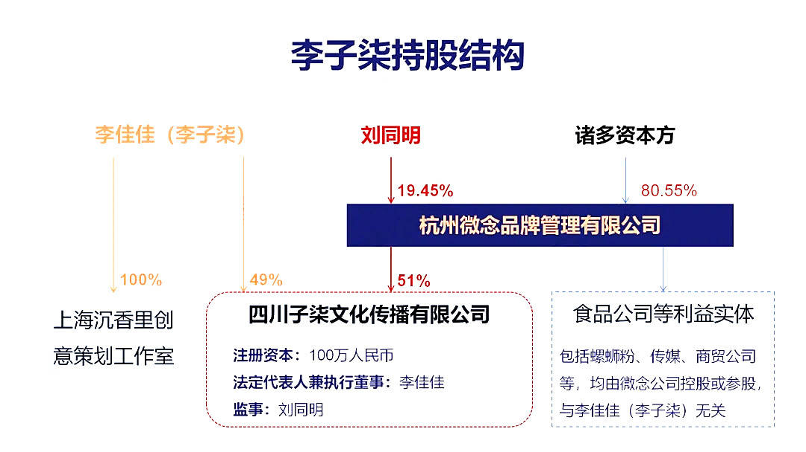
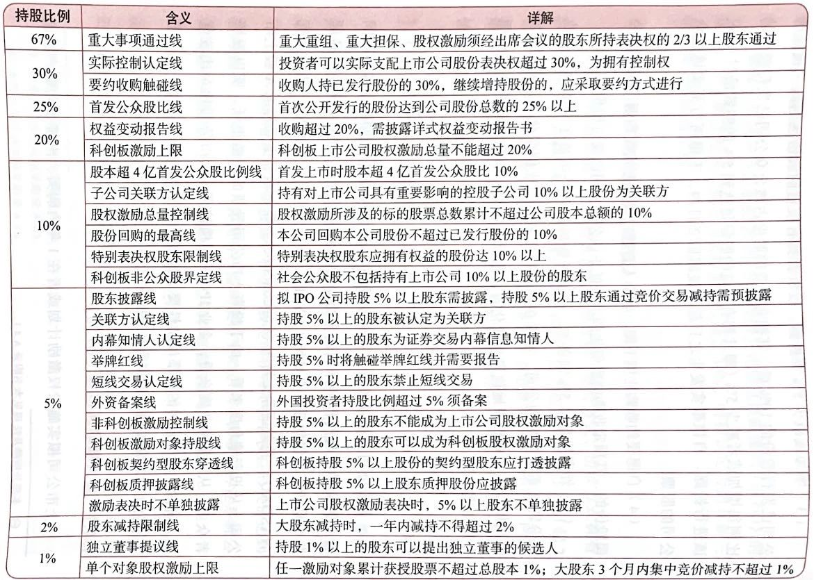
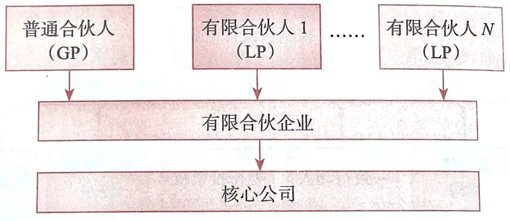
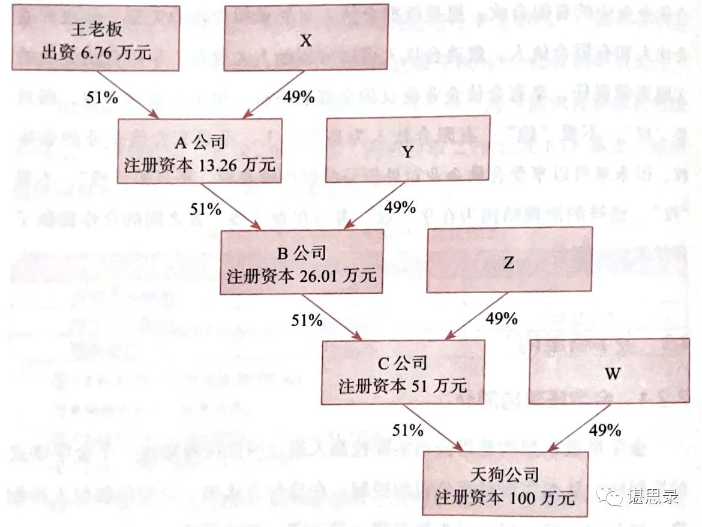

前一段时间，李子柒与微念的纷争闹得沸沸扬扬，其中涉及的股权问题更是成为大家关注和讨论的焦点。大家纷纷叹息一个现象级的内容创作者被资本控股 51%，割了韭菜。这让我对股权架构的相关知识产生了浓厚的兴趣，也疑惑于**微念控股 51% 到底意味着什么？难道就能完全支配李子柒了吗？**带着这些问题，我读了《一本书看透股权架构》这本书，在这里记下了一些笔记。

如果你也对股权架构的知识感兴趣，可以参考下面的笔记，同时**在公众号『谌思录』发送消息『股权』，可以收到一份『A 股上市公司股权架构图』资料**。

## 1、股权架构为什么很重要？

**股权设计的终极目的是为企业运营输送源源不断的、最底层、最原生的动力。**『股权架构』更是一个牵一发而动全身的系统：

- 法律方面：控制权设计、经营风险隔离。
- 税务方面：合法节税、防税务风险。
- 财务方面：融资和上市、资产保值增值、财富家族传承。
- 管理方面：推动战略落地、激活组织潜能、优化商业模式。

## 2、公司有哪些分类？

为了便于理解不同持股比例所代表的含义，可以将公司分为 4 类来分别说明：有限公司、非公众股份公司、新三板公司（属于非上市公众公司）、上市公司。这些公司各有特点：

- **有限公司**：兼具『人合』和『资合』两种属性。股东是基于股东间的信任而集合在一起，股东间的关系较为紧密；股东人数有上限，不超过 50 人；股东通过公司章程设计治理规则的空间很大；股东对外转让股权有一定的限制。一言蔽之，有限公司的股东结构更具有闭合性的特点。
- **非公众股份公司**：是纯粹的『资合公司』，资本起着决定性作用，公司的资本越雄厚，其信用越好。股东个人的声望、信用与公司信用无关。『资合公司』以出资为条件，强调资本的结合。所以，股份公司的股份转让没有限制。当有限公司改为股份公司后，标志着公司将由闭合型股权结构迈入开放型股权结构。
- **新三板公司**：新三板，即全国中小企业股份转让系统，是经国务院批准设立的全国性证券交易场所。股份公司在新三板挂牌后，股东可以通过做市转让方式和集合竞价转让方式向股票转让给符合资格的投资者。通过新三板挂牌，股东结构更具有开放性，股票的流动性也较之挂牌前有所增加。
- **上市公司**：是指股票在证券交易所上市交易的股份有限公司。

## 3、不同类型公司中持股比例意味着什么？

**1）有限公司需要重点注意的持股比例有如下几种：**

- 完美控股线 67%：对股东会所有决策，均有一票通过权。
- 绝对控股线 51%：除 7 类事项外，拥有决策权。
- 股东捣蛋线 34%：对股东会的 7 类事项决策拥有一票否决权。
- 外资待遇线 25%：外国投资者比例高于 25%，方可享受外商投资企业待遇。
- 重大影响线 20%：股东需要用『权益法』对该投资进行会计核算。
- 申请解散线 10%：拥有申请法院解散公司和召开临时股东会的权利。

上面值得注意的是**绝对控股线 51%**，这里的『绝对』很多时候会误导大家，其实『绝对控股』仅仅只是相对于『相对控股』的一个概念。根据《公司法》的规定，持股比例虽然不足 50%，但所享有的表决权足以对股东会决议产生重大影响的股东也被称为『控股股东』，这种股东通常被称为『相对控股』。

**需要切记，即使拥有 51% 的持股比例，但未达到 67%，有 7 个事项是无法独立决策的，这 7 类事项是：修改公司章程、增加注册资本、减少注册资本、公司合并、公司分立、公司解散、变更公司形式。**

所以读到这里我在本文开头的疑问已经得到了回答：**微念 51% 控股就想完全支配李子柒了吗？不，还不够，还有 7 个事项无法完全说了算。但即便如此，51% 的股权基本上已经拥有了大部分事项的决策权。**所以这里还是不由得要替李子柒可惜。

**2）非公众股份公司需要重点注意的持股比例有如下几种：**

- 申请公司解散线、股东大会召集线 10%：拥有申请法院解散公司和召集临时股东会的权利。
- 股东提案资格线 3%：有提交股东大会议案的资格。
- 股东代表诉讼线 1%：当董事高管侵害公司利益时，有权提起诉讼。

**3）新三板公司需要重点注意的持股比例有如下几种：**

- 重大重组通过线 67%：重大资产重组须经出席会议的股东所持表决权的 2/3 以上通过。
- 实际控制认定线 30%：实际支配挂牌公司股份表决权超过 30% 被认定为拥有新三板挂牌公司的控制权。
- 权益变动报告线 10%：投资人拥有权益的股份达到已发行股份的 10%，需编制并披露权益变动报告书。
- 重要股东判断线 5%：权益受限要披露；减持披露；拥有权益增减幅达 5% 要披露；自愿要约收购，约定比例不低于 5%；外资比例超过 5% 要备案。

**4）上市公司需要重点注意的持股比例有如下几种：**

- 重大事项通过线 67%
- 实际控制认定线、要约收购触碰线 30%
- 首发公众股比线 25%
- 权益变动报告线、科创板激励上限 20%
- 激励总量控制线 10%
- 重要股东判断线 5%
- 股东减持限制线 2%
- 独立董事提议线 1%

对上市公司的持股比例的相关规定其实还是很复杂的，更细节的见下图：

## 4、分股不分权有哪些方法？

如何做到分钱不分权？有这 7 种控制权设计工具可以使用：

- **有限合伙架构**
- **金字塔架构**
- **一致行动人**
- **委托投票权**
- **公司章程控制**
- **优先股**
- **AB 股模式**

在实际中，上述方法的使用频次从上到下依次递减。

## 5、有限合伙架构如何实现分股不分权？

有限合伙企业是 2007 年 6 月 1 日伴随《合伙企业法》修订而诞生的一种新的组织体。

有限合伙企业与普通合伙企业的不同之处在于：除了普通合伙人（GP，General Partner）之外，合伙人中还包括有限合伙人（LP，Limited Partner）。在合伙企业中，普通合伙人对合伙企业债务承担无限连带责任，有限合伙人则只承担有限责任。

在有限合伙企业中，股东不是直接持股核心公司，而是先搭建有限合伙企业作为持股平台，再由持股平台间接持有核心公司。典型的架构如图所示：

采用有限合伙企业作为持股平台，相比持股公司作为持股平台，有哪些优点呢？

**1）纳税上可以节税。**

根据《合伙企业法》的规定，合伙企业属于税收透明体，该层面并不征收所得税，经营收益直接穿透合伙企业流入合伙人账户，仅由合伙人缴纳一次所得税。

**2）治理结构可以钱权分离。**

相比《公司法》，《合伙企业法》赋予了合伙人设计机制极大的灵活性，无论是利益分配机制，还是合伙人的权利分配机制，都可以在合伙协议中自由约定。

合伙企业中的有限合伙，更是依据合伙人对外承担责任的类型，分成普通合伙人和有限合伙人。普通合伙人可以为创始人大股东，承担合伙企业的无限连带责任，享有合伙企业决议的全部表决权，但不分配财产权，即『只要权，不要钱』；有限合伙人为高管员工，不享有合伙企业的表决权，但未来可以享受合伙企业对外投资的财产收益权，即『只要钱，不要权』。这样的治理结构为在乎权者与在意钱者之间的合作提供了浑然天成的平台。正好可以实现企业家心中理想的『钱权分离』。

这里拿一个海康威视的案例来帮助理解：

>第一步：股权架构的选择

>海康威视于 2001 年 11 月在杭州成立，2004 年 1 月，海康威视董事会对经营团队给予期权激励，2007 年 11 月，该期权进入行权期，本次行权员工共有 51 人，他们如何持有海康威视的股权呢？当时有两种选择：

>方案 1：自然人直接持股，即：激励的员工 → 海康威视；

>方案 2：自然人间接持股，即：激励的员工 → 持股公司 → 海康威视。

>方案 1 很快被创始人股东否决。因为根据《公司法》的规定，一旦有限公司改制为股份公司，每股股本将拥有同样的表决权。这就意味着如果 51 名自然人直接持股，他们不仅拥有海康威视股份的财产权，也将海康威视股份的表决权。这样有很多弊端：在公司提案中，一旦有股东行使否决权，会增加不必要的麻烦；众多的持股人会导致程序效率低下；不利于股权激励的退出。

>海康威视最终采用了方案 2，先后成立了杭州康普投资有限公司（以下简称：康普投资）和杭州威讯投资管理有限公司（以下简称：威讯投资）作为 51 名自然人的持股平台，让他们通过两家持股公司间接持有海康威视的股份。

>第二步：持股平台性质的变更

>2011 年 5 月，海康威视员工的限售股解禁，这是出现一个问题：减持套现时的税收很高。采用『自然人 → 持股公司 → 上市公司』的间接架构，减持套现的税负为 40%，即持股公司出售股票所得交 25% 的企业所得税，此外 75% 的税后利润分红给员工时还需代扣代缴 20% 的个人所得税，加在一起即 25% + 75% × 20% = 40%。

>接下来海康威视便使用『有限合伙企业』来节税。海康威视将威讯投资和康普投资由杭州迁往新疆乌鲁木齐，并将有限公司变更为合伙企业。此举依据的是《新疆维吾尔自治区工商行政管理局有限责任公司变更为合伙企业的指导意见》中规定的允许符合条件的有限公司直接在工商局变更为合伙企业。这样一来，根据上面讲到的合伙企业属于税收透明体，该层面不征收所得税，仅由合伙人缴纳一次所得税。在新疆自然人合伙人的适用税率是 20%。2012 年海康威视员工通过威讯投资减持 12250000 股，套现 2.61 亿元并同时换取 2.79 亿元 ETF 基金，总共 5.4 亿。

>如果按照威讯投资为杭州有限公司，则需缴税：5.4 × 25% + 5.4 × 75% × 20% = 2.16 亿。如果按照威讯投资为新疆合伙企业，则需缴税：5.4 × 20% = 1.08 亿，仅为原来的一半。

>同时，新疆当地政府还规定在自然人合伙人纳税后，会给予地方留成部分 60%~80% 的财政返还。这样税负就更低了。如果以个人所得税地方留成（地方留成比例是 40%）返还 60% 为例，员工的实际税负为：1.08 - (1.08 × 40% × 60%) = 0.8208 亿。

## 6、金字塔架构如何实现分股不分权？

金字塔股权架构是指公司实际控制人通过间接持股形成一个金字塔式的控制链，从而实现对该公司的控制。是一种多层级、多链条的集团控制结构。

金字塔结构是上市公司实际控制人经常采用的架构方式，通过金字塔架构可以实现只用少量现金流权控制上市公司以方便资本运作。

下图是一个例子，王老板只出资 6.76 万元（现金流权），便通过几层纵向间接控股，最终拥有了注册资本为 100 万元的天狗公司的 51% 的话语权（控制权）。

从上面的介绍和案例可以看到，在创始人股东和拟上市公司中间搭建控股公司，即『自然人 → 控股公司 → 拟上市公司』具有以下 6 个优点：

**1）股权杠杆以小博大。**

金字塔顶端的控股股东可以用少量的自有资金控制大量的外部资金，金字塔的链条越长，控股股东用同样的财富控制的资产规模就会越大，从而实现以小搏大。

**2）纳税筹划效应。**

在『自然人 → 控股公司 → 实体公司』的架构设计中，控股公司如同一个资金池，可以把旗下被投资公司的分红很方便地调配用于再投资，而无需承担税负。除了分红，被投资公司转增注册资本，控股公司也可以享受免税待遇。

**3）便利债权融资。**

由于上市公司上面设立的控股公司可以合并上市公司报表及其他产业的报表，有些控股公司资金实力强于上市公司，受到银行认可的程度较高。所以控股公司在上市公司进行银行借款、发行债券等过程中，提供相应的担保，可以提高上市公司债项的信用等级，降低融资成本。

另外，控股公司可以在达到一定资产规模之后，以发行企业债等方式获得资金，开展一些不宜在上市公司内部开展的业务。

**4）方便人事安排。**

上市公司的元老财富自由，丧失事业激情后，可以将他们升至控股公司担任相应的虚职，腾出空间给下面的中层干部，这样既照顾了老管理层的情绪，又保证了新管理层的活力，同时打开了公司整体的晋升通道。

**5）控股公司单独上市。**

控股公司实力发展到一定程度，也可以单独在港股上市。最典型的案例有复星国际、北京控股、中国燃气等。

>2007 年 7 月，旗下已拥有 5 家 A 股上市公司的复星国际在香港主板以红筹方式上市成功。复星国际完成在香港上市，不仅为集团的境外融资打通了一个新渠道，还提升了复星国际在国际上的影响力，郭广昌等股东也具有了境内和境外财富管理及资本运作的双通道。

**6）上市后的市值管理。**

公司上市后，会通过减持、并购、定增、分红、资产注入、控股权转让等资本运作进行市值管理。

设立控股公司可以随时准备承接上市公司的非优质资产和暂时在培育期的项目，待时机成熟后单独上市或以定向增发方式注入上市公司。

设立控股公司还可以为集团公司的现在和未来发展协调各种战略资源，安排不宜在上市公司层面安排的利益。

设立控股公司，也会简化资本运作，流程提高效率。

## 7、有限合伙架构和金字塔架构有哪些差别？

有限合伙架构和金字塔架构（又称多层控股公司架构）都可以实现股权财产权和控制权的有效分离，那它们有什么差别呢？

**1）税负的差异。**

两种架构中的持股平台，可能获得两种财产收益：从被投资公司取得的分红和转让被投资公司股份所得。但是它们取得收益的纳税情况是有不同的。

下面我们参考《企业所得税法》和《个人所得税法》来看看『张三 → 控股公司 → X 公司』和『张三 → 有限合伙企业 → X 公司』税负的区别：

|                | 控股公司做持股平台 |        |          | 有限合伙企业做持股平台 |               |               |
|----------------|--------------------|--------|----------|------------------------|---------------|---------------|
|                | 控股公司           | 张三   | 税负合计 | 有限合伙企业           | 张三          | 税负合计      |
|   取得 X 分红  |   免税             |   20%  |   20%    |   不纳税               |   20%         |   20%         |
|   转让 X 所得  |   25%              |   15%  |   40%    |   不纳税               |   20% 或 35%  |   20% 或 35%  |

可见，选择何种股权架构税负更优，与持股目的相关。如果自然人为财务投资目的，则采取有限合伙企业转股套现时税负更少（20% 或 35%，有个别地方还会对合伙企业采取核定征收及财政返还，则税负会更少）。如果是战略投资人（业务联系紧密，有合作关系或合作意向，欲长期持有）采用控股公司架构在分红时跟有限合伙企业一样，但考虑到合伙企业的税收立法对纳税时点、税基计算、纳税地点等规定存在模糊性，控股公司作为持股平台是更优的选择。

**2）机制的弹性。**

《公司法》的众多条款多为强制性规范，约束性更强。比如，股东进入和退出必须经过法定的程序，一旦有限公司改制为股份公司，股份公司无法由股东约定分红等。

《合伙企业法》赋予了合伙人更多设计合伙机制的自由空间，除了极少数强制性规范外，合伙协议的条款几乎都可以根据合伙人的意志约定。所以，有限合伙企业有更强的机制灵活性。比如，可以约定执行事物合伙人拥有全部表决权，无需合伙人一人一票表决权；可以约定不按出资比例对合伙人进行利润分配。

不过也要注意，由于《合伙企业法》引入有限合伙企业制度较晚，在税收立法和工商登记等配套体系上尚未完善，在公众心目中的认知度和权威度也远不如公司制度。建议企业家用以终为始的思维，先确定持股目的，再综合考虑税收、法律、商业等维度，慎重选择持股平台。

## 8、一致行动人协议如何实现分股不分权？

我国《公司法》规定，实际控制人，是指虽不是股东，但通过投资关系、协议或者其他安排，能够实际支配公司的人。由此可见，即使不是公司股东，通过协议安排，也可以成为实际控制人。《上市公司收购管理办法》将『一致行动』定义为投资者通过协议、其他安排，与其他投资者共同扩大其所能支配的一个上市公司股份表决权数量的行为或事实。

由上述定义可见，公司股东签署一致行动人协议相当于在公司股东会之外又建立了一个有法律保障的『小股东会』。简单来讲就是抱团一致对外。不遵守一致行动协议者，则会受到协议中约定的，且在法律允许范围之内的惩罚。

需要注意的是，对于上市公司，即使上市公司股东未做一致行动人约定，也可能依据《上市公司收购管理办法》列举的一致行动人正面清单被自动认定为一致行动人。

『一致行动人』相比『有限合伙企业』和『金字塔架构』效力较弱，并非最好的控制权工具，主要原因如下：

**1）一致行动人协议有行动一致的期限。**在期限届满后，协议将失效。

**2）一致行动人协议可能因目的完成而被解除或撤销。**保持一致行动人往往是为了某种特殊目的，例如上市，一旦目的达成协议可能会被解除或者撤销。

**3）一致行动人协议对第三方没有约束力。**一致行动人协议效力仅限于签约主体，对合同外第三方，除非经过效力追认，否则没有法律效力。例如，签署一致行动人的小股东可能因为身故导致股权被继承，此时需要股东与继承人重新达成补充协议，一致行动人才得以成立。

值得注意的是，在签署一致行动人协议时，可将一致行动人协议内容写进公司章程，增加协议内容对第三方的对抗效力。

## 9、委托投票权如何实现分股不分权？

委托投票权是指股东在股东大会召开之前，已经在某些问题上进行了投票或把投票权转让给出席股东大会的其他人来行使。

委托投票权和一致行动人有什么区别呢？可以把一致行动人表述为，大股东与小股东意见一致或不一致时，都听大股东的。委托投票权则是作为委托人的股东完全放弃表决权，交由受托人行使。因此，一致行动人需要各方均为公司股东，但委托投票权的受托方可以不是公司股东。

## 10、公司章程控制如何实现分股不分权？

**公司章程被称为『公司宪法』，是股东间合作的最高行为准则，在公司内部具有最高法律地位。**

遗憾的是，实践中很少有企业家对公司章程给予足够的重视。这一方面是因为中国资本市场开发程度较低，因此公司股权结构也处于极度的闭合状态（公司股东仅限于创始人或其家族），未引入 VC/PE、高管员工、战略投资人等其他股东。另一方面是受中国数千年儒家文化的浸染，导致一部分中国企业家好面子、轻契约，不愿意在公司章程上『咬文嚼字』。

公司章程对不同类型公司的影响力有很大的差异，这里将公司分为『有限公司』和『股份公司』两种类型来讨论：

**1）有限公司**

有限公司兼具『人合』和『资合』两种属性。**《公司法》赋予了有限公司股东对公司治理更多的自治性，股东间以公司章程对彼此权利义务进行自由约定的空间更大。**

下面是企业家必须了解的关于公司章程意思自治的常识：

- 章程可以约定『分红比例和出资比例不一致』。
- 章程可以约定『不按出资比例优先认缴出资』。
- 章程可以约定『股东持股比例可与出资比例不一致』。
- 章程可以约定『表决权可与出资比例不一致』。
- 章程可以约定『限制股权转让时其他股东的优先认购权』。
- 章程可以约定『排除股东资格的继承』。
- 章程可以约定『书面形式行使股东职权』。
- 章程可以约定『召开股东会定期会议的期限』。
- 章程可以约定『召开股东会会议的通知期限』。
- 章程可以约定『股东会的议事方式和表决程序』。
- 章程可以约定『董事长和副董事长的产生办法』。
- 章程可以约定『董事会的议事方式和表决程序』。
- 章程可以约定『执行董事的职权』。

**2）股份公司**

相对于有限公司，股份公司则属于典型的『资合公司』。资合公司是指以公司资本和资产条件作为其信用基础的公司。

需要注意的是，**当一个公司从有限公司变更为股份公司，其股改的过程绝非形式意义上的名称变化，而是一个公司由闭合型股权结构向开放型股权结构转变的起点。**转变后有哪些不同呢？

- 公司章程自治性会被弱化。《公司法》会保护以资本聚合的小股东的利益，降低公司章程约定的弹性，以约束大股东通过公司章程侵害小股东权益。
- 股的流动性和包容性更强。《公司法》规定股东转让股份公司的股份，其他股东并没有优先认购权。股份公司的股份转让更加自由。
- 控制权失控的可能性增加。股权按流动性排序，依次为：上市公司股票 > 新三板公司股票 > 非公众股份公司股份 > 有限公司股权。流动性增加的同时也意味着股东对公司失控的可能性越来越大。

## 11、优先股如何实现分股不分权？

优先股是指依照《公司法》，在一般规定的普通种类股份之外，另行规定的其他种类股份，该股份持有人**优先于普通股股东分配公司利润和剩余财产，但参与公司决策管理等权利受到限制**。通俗来讲，优先股股东以放弃部分表决权为代价，换取了优于普通股股东分配公司利润和剩余财产的权利。

如今，可以公开发行优先股的公司限于证监会规定的上市公司；可以非公开发行优先股的公司限于上市公司（含注册在境内的境外上市公司）和非上市公众公司。

优先股股东能享受哪些优先权益呢？

- 优先获得固定股息。在公司依法弥补亏损、提取法定公积金后依照公司经审计的母公司报表有可分配利润的情况下，优先股股东可以优先按照约定的票面利率获得股东配发的股息。
- 回售权。优先股股东在优先股限售期届满后，有权向公司回售其所持有的优先股。

优先股股东又将放弃哪些表决权权利呢？除法律法规或《公司章程》规定需由优先股股东表决权事项外，优先股股东没有请求、召集、主持、参加或委派股东代理人参加股东大会的权利。

实际中，优先股并未成为高频次的控股权设计工具，主要是因为应用空间有限，目前只能应用于 4 类公司：

- A 股上市公司或 H 股上市公司
- 新三板挂牌公司
- 有限责任公司
- 海外上市公司

## 12、AB 股如何实现分股不分权？

通常公司的股权结构为一元制，及所有股票都会同股同权、一股一票，但在英美法系下的类别股份制度里存在二元制股权结构（又称为 AB 股结构），**即管理层试图以少量资本控制整个公司，因此将公司股票分别赋予高、低两种投票权，高投票权的股票每股具有 N 票（多为 10 票）的投票权，称为 B 类股，主要由管理层持有；低投票权的股票由一般股东持有，每股只有 1 票甚至没有投票权，称为 A 类股。作为补偿，B 类股一般流通性较差，一旦流通出售，即从 B 类股转为 A 类股。**

AB 股最初盛行于美国互联网创新企业，因为互联网公司通常在企业发展前期对资本投入需求较大，经过多次股权融资，创始团队的持股比例已经被摊薄得很严重了。通过 AB 股来选择放手让创业团队施展，对创业团队和投资者都是一种利好和保护。

虽然 AB 股深受资本驱动型企业的创始人喜爱，但是在中国，AB 股的适用范围十分狭窄，仅适合以下 3 类企业：

- 科创板上市公司
- 有限公司
- 境外上市公司

实施 AB 股需要良好、健全的法治环境以及严格、成熟的外部监管，来保证外部投资者的利益。如今，香港港股已经接纳同股不同权架构的公司。随着中国内地资本市场法律法规体系的日趋成熟、政府监管能力的不断提升、中国股民素质的不断提高，相信中国内地的主板、中小板创业板终有一天也会对同股不同权的安排敞开怀抱。

## 最后

通过上面的笔记，我们知道了不同类型公司中持股比例意味着什么，也初步了解了分股不分权有哪些方法可以使用，希望能对大家有一些帮助。更多关于公司股权架构的知识，还是推荐去阅读一下《一本书看透股权架构》原书。

此外，在公众号『谌思录』发送消息『股权』，可以收到一份『A 股上市公司股权架构图』资料供大家参考。

[SamirChen]: http://www.samirchen.com "SamirChen"
<!-- [1]: {{ page.url }} ({{ page.title }}) -->
[2]: http://samirchen.com/rn-shareholding-structure.md

