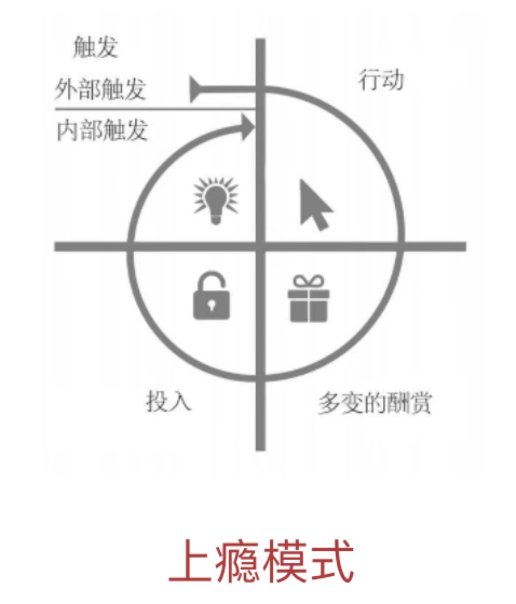
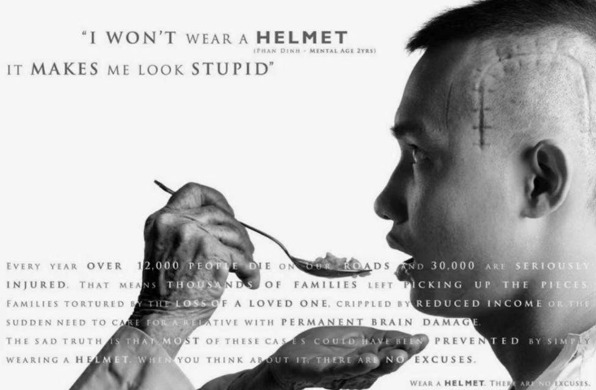
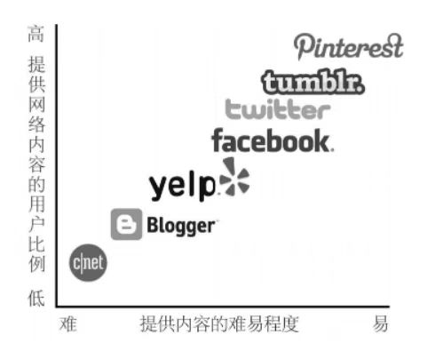
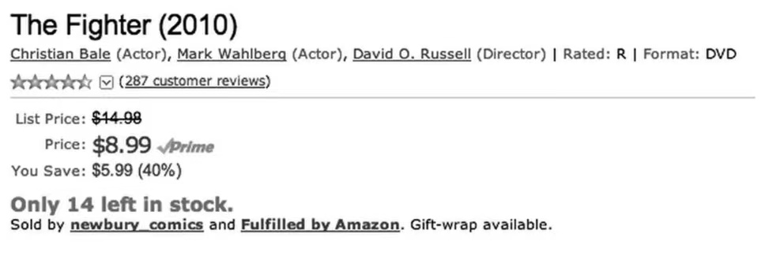

最近读了《上瘾》这本书，这本书的理论内容其实比较简单，但我觉得里面最有意思是各种案例。所以，这篇笔记除了记录一些关键结论外，主要记下了一些案例，没事翻翻，说不定能在实践中用得上。

这本书给出了一个极其简明的上瘾模型：触发 → 行动 → 多变的酬赏 → 投入。

万事开头难。第一步就是引发用户去使用你的产品，这叫作『触发』。

触发之后，第二步就是『行动』，行动要兼具动机和能力，有了动机，还需要用户的能力足够完成行为。

行动之后，要给用户酬赏，还得是『多变的酬赏』。所谓多变的酬赏，就是指酬赏要有不可预期性。

最后，是让用户在产品上进行越来越多的『投入』。用户与产品亲密接触得越多，就越离不开它。通过用户的投入，就可能产生下一次触发，从而开始一个正向循环。于是你就上瘾了。

## 1、习惯的力量

习惯是大脑借以掌握复杂举动的途径之一。神经系统科学家指出，人脑中存在一个负责无意识行为的基底神经节，那些无意中产生的条件反射会以习惯的形式存储在基底神经节中，从而使人们腾出精力来关注其他的事物。

当大脑试图走捷径而不再主动思考接下来该做些什么时，习惯就养成了。为解决当下面临的问题，大脑会在极短的时间内从行为存储库里提取出相宜的对策。所谓的根深蒂固的习惯，是人在几乎无意识的状态中做出的举动。

**所以，我们的习惯就类似于我们大脑中缓存的一堆驱动行为的快捷方式，它几乎无意识，但是高效快速。本书中要介绍的上瘾模型，在很大程度上就是按照产品的目标去设计和养成用户的习惯。**

这里面需要注意的是：

- 用户对其产品形成的使用习惯是某些企业生存发展的根本，但并非所有企业都受制于此。
- 一旦成功地使用户对其产品形成了使用习惯，企业就能获益匪浅，具体表现在：更高的用户终身价值，更大的价格灵活性，更快速的增长，以及更强的竞争优势。
- 只有当某种行为的发生频率足够高、可感知用途足够多时，它才可能发展为习惯。
- 习惯养成类产品起初都是非必需品（比如维生素），可一旦发展为习惯，它们就会变成必需品（比如止痛药）。
- 习惯养成类产品通过『挠痒痒』减轻用户的痛苦。
- 设计习惯养成类产品其实是在操控对方的行为。生产企业在做设计之前，最好先审慎思考，以确保自己的设计会引导用户形成健康的习惯，而不会发展为病态的成瘾。

## 2、触发

触发就是指促使你做出某种举动的诱因，就像是发动机里的火花塞。触发分外部触发和内部触发。让你产生习惯性依赖的那些产品往往是外部触发最先发挥作用，例如电子邮件、网站链接，或是手机上的应用程序图标。

**外部触发对应于行动召唤，通常通过将信息渗透在用户生活的各个方面来引导他们采取下一步行动。**

使用外部触发仅仅是第一步。各种类型的外部触发都只有一个终极目标：驱使用户进入上瘾模型并完成余下的循环步骤。当驱动他们经历一整套循环之后，外部触发将不再发挥作用，取而代之的是：内部触发。当某个产品与你的思想、情感或是原本已有的常规活动发生密切关联时，那一定是内部触发在起作用。

**内部触发通过用户记忆存储中的各种关联来提醒他们采取下一步行动。**

负面情绪往往可以充当内部触发。

要开发习惯养成类产品，设计者需要揣摩用户的心理，了解那些有可能成为内部触发的各种情绪，并且要知道如何利用外部触发来促使用户付诸行动。

一个例子：Instagram 的成功

>Instagram 对于某些用户就像是一个寄托情思与灵感的港湾，他们得以用影像记录生活。正是因为人们担心某个宝贵时刻会一去不复返，所以才会感觉到压力如山。这种负面情绪构成的内部触发会促使人们借助这个应用来捕捉光影，以缓解他们内心的痛苦。在用户持续体验这项服务的过程中，新的内部触发会逐渐形成。
>
>Instagram不仅具备相机的功能，还为用户搭建了一个社交网络平台。与很多社交网络一样，Instagram还可以有效地缓解『社交控』这一症状。

## 3、行动

触发之后就是行动，意即在对某种回报心怀期待的情况下做出的举动。上瘾模型的这个阶段，吸收了艺术性和实用性相结合的设计原则，意在呈现产品是如何驱动特定的用户行为的。为了提高人们某种行为的发生频率，产品设计者充分利用了人类行为的两个基本动因：一是该行为简便易行，二是行为主体有这个主观意愿。

行动是上瘾模型的第二个阶段。

行动是人们在期待酬赏时最直接的反应。

根据福格博士建立的行为模型：

- 1、要促成某种行为，触发、动机和能力这三者缺一不可。
- 2、要增加预想行为的发生率，触发要显而易见，行为要易于实施，动机要合乎常理。
- 3、人类行为不外乎受三种核动机的影响：追求快乐，逃避痛苦；追求希望，逃避恐惧；追求认同，逃避排斥。
- 4、时间、金钱、体力、脑力、社会偏差、非常规性等六个因素（简洁性 6 元素）会对用户的能力产生影响。能力还会因人因地而异。

启发法（基于行为经济学的研究）是指我们借助认知经验对事物做出快速判断。产品设计者可以从上千种启发法中选择一些来获取灵感，提高产品的吸引力。

一个动机相关的例子：性卖点

>一个经常被广告商利用的动机就是老话所说的『性卖点』。当然，这种广告策略只适用于对其格外敏感的部分人群，比如青春期的男孩子。其他人则不一定，没准还会非常反感这样的广告。所以，你一定要知道自己的目标客户到底需要些什么。
>
>

一个动机相关的例子：啤酒绑定社交

>啤酒生产商百威的广告利用了社交凝聚力这一动机，用三个携手为国家队助威的年轻男子形象来为自己的产品做宣传。尽管啤酒和社交生活没有直接联系，但是图片强化了这一啤酒品牌所蕴含的好友情深的理念，让人们过目难忘。
>
>

一个动机相关的例子：利用恐惧的负面情绪充当动机

>男子是一位残疾人，脑袋上的伤疤触目惊心。该男子在交通事故发生后仅有两岁智龄的形象，让观者不寒而栗。这则广告是要提醒人们，骑摩托车一定要戴安全头盔。
>
>

作者丹尼斯·豪普特利在《创新轻松三步法》一书中将产品的创新过程分解成了三个基本步骤：

- 第一步，了解人们使用某个产品或服务的原因。
- 接下来，列举出用户使用该产品时的必经环节。
- 最后一步，在明确整个过程的所有环节之后，开始做减法，把无关环节全部删除，直至将使用过程简化到极致。

这也说明了要促成某种行为，一定要简化产品，让用户有『能力』完成。

一个能力相关的例子：互联网产品简化内容生产促进了内容繁荣

>互联网产品的发展演进历程告诉我们，推动网络创新一步步走到今天的原动力，就是将行为简单化。正是因为简化了的行为，才使得烦琐的网络内容提交演变为如今这场全民参与的狂欢。
>
>

一个行为经济学的例子：稀缺性改变人们对价值的判断，从而促进行动

>亚马逊网站从一个相反的角度向我们证明，限制产品供应反而能增加销量。
>
>

一个行为经济学的例子：环境同样会影响人们的价值判断

>在一次社会学实验中，世界级小提琴家约书亚·贝尔在华盛顿特区的一个地铁站进行了一场免费的音乐表演。要在平时，人们只有在肯尼迪艺术中心或是卡内基音乐厅这样的地方才能欣赏到贝尔的演出，单人票价高达上千美元。但是当演出地点改在了地铁站，他的音乐不啻对牛弹琴。几乎没有一个过路人意识到，他们视而不见的这个人，正是全世界最有才华的音乐家之一。

## 4、多变的酬劳

科学研究表明，人们在期待奖励时，大脑中多巴胺的分泌量会急剧上升。奖励的变数越大，大脑分泌的这一神经介质就越丰富，人会因此进入一种专注状态，大脑中负责理性与判断力的部分被抑制，而负责需要与欲望的部分被激活。老虎机和彩票就是最典型的例子。

一个例子：

>你打开冰箱门，里面的工作灯就会亮起，这个结果在你预料之中，所以你不会没完没了地重复开门这个动作。假如给这个结果添加一些变量，比如说，每次打开冰箱门，你眼前都会像变戏法一样冒出一些小玩意，那就说明，老兄，你的渴望被点燃了。

『多变的酬赏』是上瘾模型的第三个阶段，共包含三种类型：社交酬赏、猎物酬赏、自我酬赏。

- 社交酬赏，是指人们从产品中通过与他人的互动而获取的人际奖励。
- 猎物酬赏，是指人们从产品中获得的具体资源或信息。
- 自我酬赏，是指人们从产品中体验到的操控感、成就感和终结感。

在自主权受到挑战时，我们会感到自己失去了选择的自由，通常会对某种新的行为习惯产生排斥。心理学家称之为『逆反心理』。因此，保障用户的自主权是吸引他们的关键。

『有限的多变性』会使产品随着时间的推移而丧失神秘感和吸引力，而『无穷的多变性』是维系用户长期兴趣的关键。

产品中『多变的酬赏』在吸引用户的同时，必须满足他们的使用需求。

一个酬赏多变性的例子：鸽子实验

>心理学家斯金纳在 20 世纪 50 年代开展过一项研究，试图了解多变性对动物行为的影响。斯金纳先是将鸽子放入装有操纵杆的笼子里，只要压动操纵杆，鸽子就能得到一个小球状的食物。鸽子很快就发现，压动操纵杆和获得食物这二者之间存在因果关系。
>
>在实验的第二阶段，斯金纳做了一点儿小小的变动。这一次，鸽子压动操纵杆后不再是每次都得到食物，而是变为间隔性获取。也就是说，有时能得到，有时得不到。斯金纳发现，当鸽子只能间隔性地得到食物时，它压动操纵杆的次数明显增加了。多变性的介入使得它更加频繁地去做这个动作。
>
>斯金纳的鸽子实验形象地解释了驱动人类行为的原因。最新的研究也证明，多变性会使大脑中的伏隔核更加活跃，并且会提升神经传递素多巴胺的含量，促使我们对酬赏产生迫切的渴望。

一个酬赏多变性的例子：信息流的内容多变性

>『信息流』已经成为很多在线业务的基本组成部分。源源不断出现在滚动屏幕上的信息就像猎物一样让人们不停追逐。Twitter 上以时间顺序排列的信息流就是一个典型。它用日常的、相关的内容填满了这个空间。内容的多变性为用户提供了不可预测的诱人体验。有时，用户会在这个信息流上看到一条格外有趣的信息，而有时又看不到。但是为了继续这种狩猎的体验，他们会不停地滑动手指或是滚动鼠标，目的就是寻找多变的酬赏。

一个自我酬赏的例子：游戏玩家通关升级

>玩视频游戏时，玩家努力掌握游戏技巧打通关的过程就是一种对自我的酬赏。升级、获取特权等游戏规则都可以满足玩家证明自己实力的欲望。

一个酬赏的例子：社交酬赏 vs. 经济酬赏

>2007 年，Mahalo.com网站面世，这是一家以问答平台为主打业务的新网站。在网站上发问的用户需要提供一笔 Mahalo 币（虚拟货币）作为奖金。接着，其他用户可就此问题提交答案，最佳答案提交者将获得这笔奖金并可将其兑换为现金。
>
>一开始，这一招的确奏效。新用户纷至沓来，最红火的时候，Mahalo 的月访问量达到了 1410 万人次。只可惜好景不长，人们的参与热情很快冷却了下来。尽管他们能够从中获得酬赏，但是这种单纯的经济刺激手段似乎不具备持久的吸引力。
>
>在 Mahalo 想方设法留住用户的同时，另一家问答型网站开始崭露头角。2010 年，两名曾经就职于 Facebook 的员工成立了 Quora 网站。在极短的时间里，Quora 就获得了大众的热捧。不同于 Mahalo 的是，Quora 没有给提交答案者奖励过一分钱。为什么人们会无视 Mahalo 的经济奖赏，而宁愿去当 Quora 的铁杆支持者呢？
>
>Quora 之所以成功，是因为它准确把握了人们的心理。事实证明，人们对于社交酬赏以及同伴认同的渴望要远远大于对经济利益的期待。Quora 设计的投票系统可以让用户对满意的答案投出赞成票，从而建立起一套稳定的社交反馈机制。比起 Mahalo 的经济酬赏，Quora 的社交酬赏更有号召力。

一个保护用户自主权的例子：Quara 的访问者列表引发的问题

>为了增强号召力，Quora 在网站上添加了可视功能，可将所有浏览过某个问题或答案的访问者的真实身份显示出来。能够看到有哪些人浏览过自己添加的内容，这对于用户而言无疑是种新奇的体验。设想一下，如果是某个名人或者某个重量级的风投阅读过你的留言，那是不是很刺激？
>
>结果却事与愿违。Quora 在没有提醒用户他们的浏览记录将会公之于众的情况下，自动把这项新功能强加给用户。顷刻间，用户视若珍宝的匿名权利荡然无存，他们无法继续隐藏身份地在 Quora 网站上提问、回答或者是浏览一些私密问题了。这一改变招来了用户的一片声讨，Quora 只好在数周后作罢，放弃了这次新的尝试。

一个关于用户自主权的例子：卸下用户的防御

>在一项研究中，研究者想知道，当一个陌生人用经过设计的特定话语向人们索要车费时，人们给出的金额是否会有不同。结果证明，他们设计的这个特定话语虽然简单，但极其有效，人们给出的金额是平时的两倍。
>
>事实表明，这句特定话语不仅说服人们给出了更高的车资，还能有效提高人们在慈善捐款中所做的贡献，并推动更多的人志愿参与社会调查。
>
>研究人员设计出的这句神秘话语就是：**你有权接受，也有权拒绝。**
>
>研究人员认为，那句简单的『你有权』卸去了我们本能的防御之心，我们不再有听命于人的不适感。然而，当对方提出要求的同时用熨帖的话语肯定你的自主权时，『逆反心理』就会不翼而飞。

一个关于用户自主权的例子：被抛弃的健康应用

>以培养更加健康的饮食习惯为例。很多美国人都把这作为一个基本的生活目标。几年前，我曾经动过减肥的念头，所以也下载安装了 MyFitnessPal。它很容易上手，我只需输入自己的食谱，就能得到程序基于我设定的减肥目标而给出的卡路里摄入量建议。
>
>然而，在使用 MyFitnessPal 之前，我并没有关注自己卡路里摄入量的习惯，所以在最初的新鲜劲儿过去之后，它就变成了累赘。为一日三餐写日志既不是我的义务，也不是我当初下载这个程序的初衷。我想要减肥，而这个程序却在一个劲儿地让我记录自己的卡路里摄入量和消耗量。很快，我就发现自己一旦忘记输入某一餐的食物细节，就很难再继续发挥这个应用的效用，以至于那一天苦心经营的减肥食谱形同虚设。没过多久，这种在手机上对自己饮食违纪行为供认不讳的做法就变成了强加于我的负担。最终我选择了放弃。
>
>Fitocracy 是截然不同的另外一款减肥软件。它的目标与同类软件相同，都是帮助使用者培养健康的饮食习惯，制订合理的训练计划。不同之处在于，用户从中感受到的是自主参与，而非不得已为之。首先，Fitcracy 和其他软件一样，也鼓励用户记录下自己的饮食和运动情况。但其高明之处在于，它清楚大部分用户都缺乏耐性，所以，在我的逆反心理发作之前，Fitcracy 就开始用社交奖励挽留我了。当我将自己的第一次运动记录上传至网站后，会收到其他用户发表的评论。它首先是一个在线社交平台，通过惟妙惟肖地再造真实世界健身房里人们叽叽喳喳的情景而虏获人心。在此之前，通过网络和志同道合的朋友进行交流早已司空见惯，但是 Fitcracy 将这种交流方式进一步简化，并且使人们从相互鼓励、交流经验和收获赞扬中获得安慰。

一个关于多变性的例子：《绝命毒师》的多变性剧情

>2008 年开播的电视连续剧《绝命毒师》，收视率一路火爆，打破了吉尼斯世界纪录。优秀的创作团队和演出人员自然功不可没，但是究其根本，这部电视剧的成功其实是缘于一个再简单不过的手段。
>
>每一集（同时也是每一季的叙事主线）都围绕一个亟待主人公解决的难题展开。接二连三的悬疑情节让观众迫不及待地想知道故事接下来会如何发展。和其他剧集一样，难题会在每集结束时得到解决，而另一个新的麻烦又会初露端倪，观众将带着好奇继续关注下一集的剧情。按照制作方的设计，你要想知道沃尔特如何走出上一集尾声中的困境，唯一的办法就是继续关注下一集。
>
>从冲突爆发、疑点频现再到难题告破，这一套叙事手段再寻常不过，但每一个成功的叙事总包含一个核心元素，那就是**多变性**。

一个关于多变性的例子：Zynga 的各种小镇

>也许没有哪家公司能够像 Zynga 那样生动地诠释多变的酬赏那难以捉摸的特性了。Zynga 开发了 Facebook 上的热门游戏『农场小镇』。2009 年，这款游戏成为全世界玩家不可错过的一个经典游戏。凭借 Facebook 这个平台，该游戏以每月吸引 8380 万活跃用户的优秀战绩破了纪录。
>
>看似一路凯旋的 Zynga 紧接着将『农场小镇』的成功经验照搬到了新项目上。它接连推出了『城市小镇』、『主厨小镇』、『边境小镇』等数个以『小镇』为核心词的游戏，期待人们像当初追捧『农场小镇』时一样为之疯狂。然而，同年 11 月，Zynga 的股票价格下跌了 80%。人们发现，它所开发的新游戏其实是新瓶装老酒，只是借用了『农场小镇』的外壳，所以玩家的热情很快消失，投资商也纷纷撤资。曾经引人驻足的创新因为生搬硬套而变得索然无味。由于多变特性的缺失，『小镇』系列游戏风光不再。

一个关于多变性的例子：有限多变性和无穷多变性

>给产品附加『无穷的多变性』则有助于人们保持持久的兴趣。例如，单人通关游戏中包含的是『有限的多变性』元素，而联机多人游戏则包含『无穷的多变性』，因为整场游戏怎么玩全由玩家自己说了算。『魔兽世界』就是一款风靡全球的大型多人角色扮演类网络游戏，问世已有 8 年之久，至今依然拥有一千多万固定玩家。与单人参与的『农场小镇』不同，『魔兽世界』强调团队作战，因此团队其他成员在游戏中的表现就成为不可预知的因素，而这正是其经久不衰的魅力所在。
>
>诸如 YouTube、Facebook、Pinterest 和 Twitter 这样的网站都存在一个特性，那就是利用用户提供的内容来制造源源不绝的新意。蕴含『无穷的多变性』的产品赢得用户忠心的胜算要更大，所以那些在多变性上不具备优势的产品必须经常更新换代才能跟上时代的步伐。

## 5、投入

当用户为某个产品提供他们的个人数据和社会资本，付出他们的时间、精力和金钱时，投入即已发生。投入并不意味着让用户舍得花钱，而是指用户的行为能提升后续服务质量。添加关注，列入收藏，壮大虚拟资产，了解新的产品功能，凡此种种，都是用户为提升产品体验而付出的投入。这些投入会对上瘾模型的前三个阶段产生影响，触发会更易形成，行动会更易发生，而酬赏也会更加诱人。

行动阶段使用户即时获得满足，而投入阶段主要与用户对未来酬赏的期待有关。

对产品的投入会令用户形成偏好，因为我们往往会高估自己的劳动成果，尽力和自己过去的行为保持一致，避免认知失调。

用户只有在享受了各种酬赏之后才会对产品进行投入。

用户对产品的投入不仅可改进产品服务质量，增加用户再次使用产品的可能性，还能令储存价值以内容、数据资料、关注者、信誉或技能等形式自然增长。

用户投入可通过加载下一个触发的方式令用户重新开始上瘾循环，从而增加了用户反复进入上瘾循环的可能性。

一个投入相关的例子：宜家效应

>宜家是全球最大的家具零售商，销售价格合理的各式待组装家具。这家瑞典公司的主要创新之处在于产品的平板包装方式，该包装方式降低了公司的劳动成本，提高了配送效率，节约了仓库的存储空间。
>
>与其他公司销售已组装完毕的家具不同，宜家让客户自己动手组装家具。原来，让客户投入体力劳动有一个看不见的好处。阿雷利认为，通过自己动手，客户对自己组装的家具会产生一种非理性的喜爱，就像折纸实验中的被试者一样。很多企业会利用用户的投入给自己的产品赋予更高的价值，其原因仅仅是用户曾为产品付出过努力，对产品投入了自己的劳动。

一个投入相关的例子：Twitter 跟帖

>在 Twitter 上，用户投入的表现形式是跟帖。跟帖不会带来即时回报，也不会颁发星星或徽章对跟帖行为予以肯定。跟帖是对服务的一种投入，这种投入会增加用户今后浏览Twitter的可能性。
>
>使用苹果公司音乐软件 iTunes 的用户只要添加歌曲到自己的收藏中，就会强化自己和该服务之间的联系。
>
>每一次更新状态、点赞、在 Facebook 上共享照片或视频，所有这些行为都会进入用户的历史记录，告诉我们他过去的经历和各种人际关系。随着用户对网站的个人投入不断增加，要放弃这些服务就会变得更加困难。
>
>在商务化社交网站 LinkedIn 上，用户的在线简历体现了具有储存价值的数据资料概念。每当求职者使用该服务，他们就会按提示添加更多信息。LinkedIn 公司发现，用户向网站输入的信息越多，其光顾网站的频率就越高。

---

现在你可以利用上瘾模型询问自己关于如何让用户上瘾的五个基本问题：

- 1、用户真正需要什么？你的产品可以缓解什么样的痛苦？（内部触发）
- 2、你靠什么吸引用户使用你的服务？（外部触发）
- 3、期待酬赏的时候，用户可采取的最简单的操作行为是什么？如何简化产品使该操作行为更轻松容易？（行动）
- 4、用户是满足于所得酬赏，还是想要更多酬赏？（多变的酬赏）
- 5、用户对你的产品做出了哪些点滴投入？这些投入是否有助于加载下一个触发并储存价值，使产品质量在使用过程中获得提升？（投入）

[SamirChen]: http://www.samirchen.com "SamirChen"
<!-- [1]: {{ page.url }} ({{ page.title }}) -->
[2]: http://samirchen.com/rn-brand-flip.md

