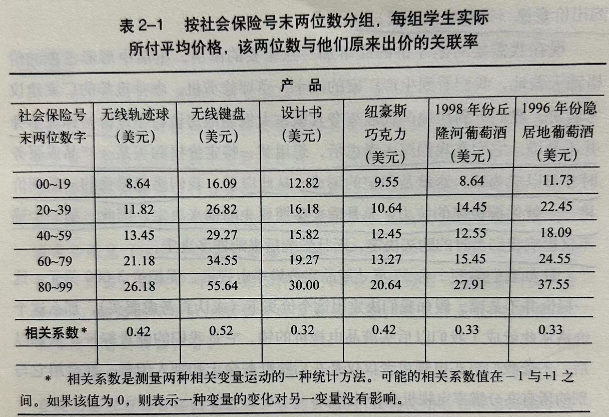

《怪诞行为学》是一本普及「行为经济学」的书籍，作者在多个方向通过丰富的案例来探索人们的非理性行为以及背后的决策过程，并提出了一个重要的观点：**我们不单单是非理性的，我们的非理性还会一次又一次以相同的方式发生，也就是我们的非理性行为是可预测的。**这就意味着，当我们懂得了非理性的预测方法，我们可以利用它来**改进我们生活和工作中的决策**。

---

这本书中最有趣的就是那些初看习以为常、再看直呼精彩的案例和分析，其中很多都可以作为我们做决策的重要参考。这篇读书笔记，我们先来看看第一章：

## 1、相对论的真相：我们为什么喜欢比较和攀比？

本书在第一章中着重介绍了**人们喜欢在容易对比的选项中做决策**的思维惯性，正是由于这种可预测的非理性特征，很多商业和生活案例基于**诱饵效应**设计了**诱饵选项**来引导人们的决策行为。文中给出了多个相关案例，值得借鉴，也值得反思。

### 本章中有趣的观点

- **人脑思维惯性**：我们总靠观察周围的事物以确定彼此的关系。我们无法不这样。人们很少做不加对比的选择。我们不但喜欢拿事物与事物作比较，还喜欢把容易比较的事物集中作比较，避免把不容易比较的事物作比较。

- **诱饵效应的工作机制**：在下图中，把 -A（诱饵）放进来，建构出与 A 的一种简单、直观的比较关系，由此使 A 看来较优，不仅相对于 -A，相对于 B，也会让我们以为 A 不仅比 -A 好，也比 B 好。结果就是，把 -A 加到场景中，即使根本没人选择它，但它会使人们更可能最终选择 A。

- **反思**：凭相对因素作决定是我们自然而然的思考方式，但却是我们要格外注意去跳出的怪圈。

### 本章中有趣的案例

#### 案例 1.1：《经济学人》的定价诱饵

对于上面订阅套餐的选择，在一大批参与者中作调查，结果大多数人倾向于选择「印刷加电子版套餐」。

比如，在麻省理工学院的斯隆商学院，将选项略加修改为：

- 单订电子版：59 美元
- 单订印刷版：125 美元
- 合订印刷版加电子版套餐：125 美元

然后让 100 个学生做出选择，结果是：

- 单订电子版 59 美元：16 人
- 单订印刷版 125 美元：0 人
- 合订印刷版加电子版套餐 125 美元：84 人

当把上面 3 个选项中的「单订印刷版：125 美元」去掉，再次让 100 个学生做出选择，这次结果是：

- 单订电子版 59 美元：68 人 // 增加了 52 人
- 合订印刷版加电子版套餐 125 美元：32 人 // 减少了 52 人

我们可以发现：**「单订印刷版：125 美元」这个选项其实就是一个『诱饵』，它对于诱导大家选择「合订印刷版加电子版套餐：125 美元」起到了重要的作用。**

这是因为：**人们很少做不加对比的选择。在这个案例中，在「单订电子版：59 美元」和「单订印刷版：125 美元」之间做选择有些费脑筋，大家没那么容易分析哪个更划算，但是与「单订印刷版：125 美元」相比，「合订印刷版加电子版套餐：125 美元」看起来就划算多了，都不用费脑筋就很容易做出选择，以至于大家甚至把「单订电子版：59 美元」这个选项都给忽略了。**

#### 案例 1.2：餐厅菜单上的定价诱饵

餐厅菜单上主菜的高标价能给餐厅增加盈利，即使没人来点。因为尽管人们一般不会点菜单上标价最贵的菜，但他们很可能点排在第二位的。出于这个目的，**餐厅推出一道高价菜，这样可以引诱顾客点次贵的菜。**

#### 案例 1.3：购房选择的诱饵

有 3 处房子，一幢是现代风格，另两幢是老式风格，价格差不多，都很合意。唯一的差别是老式房子中的一幢（诱饵）屋顶需要换，你选哪幢？ 通常，我们很可能会选那幢不需要换屋顶的老式房子。在这个决定过程中，我们现代风格的房子一无所知（甚至没有另一幢和它作比较），于是它被放到一边了。**不过我们确切的知道老式房子中，不换屋顶的比要换屋顶的那幢要好，于是我们决定买那幢不换屋顶的。**

#### 案例 1.4：拯救面包机的销量

威廉斯-索诺马公司首次推出家用烤面包机时，多数消费者并不感兴趣。为了拯救糟糕的销售业绩，面包机厂家请来营销公司提出了一个补救办法：**再推出一个新型号的面包机，不仅个头比现在的要大，价格也要比现有的型号高出约 50%。**这一下原来的面包机的销量开始提升了。

为什么呢？因为**消费者现在有了两个型号可以选择，既然一台比另一台明显要大（笨重、占空间），也贵了很多，人们无须中真空中作决定了**。

#### 案例 1.5：钢笔和西服的相对论

这是一个实验。假如你今天有两件事要做：第一件时买支新钢笔，第二件时买上班穿的套装。你现在到的商店里钢笔 25 美元，但是如果你走 15 分钟去另外一家店买，同样的钢笔会便宜 7 美元。你去不去？你现在到的商店里西服 455 美元，但是如果你走 15 分钟去另外一家店买，同样的西服会便宜 7 美元。你去不去？

实验结果显示，多数人选择走 15 分钟到另外一家店买便宜 7 美元的钢笔，但是多数人却不愿意走 15 分钟到另外一家店买便宜 7 美元的西服。

从理性上来讲，在这类情况下你应该考虑的唯一问题上：多花 15 分钟去另一家店省下 7 美元，是不是值得。至于这 7 美元是从 10 美元还是从 1000 美元里省下的，与此无关。

但是，当人们用相对比较的方法来看待我们的选择时，两支钢笔的差价使价格较低的钢笔的**相对优势**远远高于另一支，这个明显的答案让多数人选择多花 15 分钟节省 7 美元，而两套西装的差价使那套价格较低的西装的**相对优势**显得很小，使得多数人宁愿多花 7 美元。

我们真正应该考虑的问题是：花 15 分钟省 7 美元是否值得。而要避免被套进这 7 美元是从 25 美元里省的还是从 455 美元里省的相对论圈套里。

同样的问题发生在：有人会轻易地在价值 5000 美元的宴会上多加一道 200 美元的主菜，但是却去剪优惠券从价值 1 美元的罐头里节省 25 美分。有人给一辆 25000 美元的汽车加 3000 美元的真皮座椅不觉得贵，却不愿意花同样的钱来买一套真皮沙发，尽管我们知道在家坐沙发的时间要比坐汽车里长。

---

## 2、供求关系的失衡：为什么珍珠无价？

这章主要介绍了**锚定效应**的影响，有两点值得注意：

- 1）最初的锚可能是任意的，不一定是经过理性思考或深思熟虑；
- 2）最初的锚具有长久而持续的影响，不管这个锚是不经意的还是深思熟虑的。

此外，本章还介绍了**自我羊群效应**，它像是对锚定效应的长久影响力的一种解释。

### 本章中有趣的案例

#### 案例 2.1：从无人问津到稀世珍宝的黑珍珠

1973 年的一天，一位年轻人布鲁耶向“珍珠王”萨尔瓦多・阿萨尔介绍了一座小岛上的特产：黑珍珠，他说服萨尔瓦多合伙开发这一产品。早期的黑珍珠色泽不佳，又灰又暗，大小也不行，销量很差。后来，萨尔瓦多他们努力改良出一些上好品种，然后带着样品去见了一位传奇色彩的宝石商人哈利・温斯顿，温斯顿同意将这些黑珍珠样品放到他在第五大道的店铺橱窗里展示，标上令人难以置信的高价。同时，萨尔瓦多在数家影响力广泛、印刷华丽的杂志上登出广告，在广告里，一串塔希提黑珍珠在钻石、红宝石、绿宝石的映衬下熠熠生辉。原来不知价值几何的东西，现在被萨尔瓦多捧成了稀世珍宝。

萨尔瓦多从一开始就把他的黑珍珠与世界上最贵重的宝石「锚定」在一起，此后它的价格就一直紧跟宝石。同样的，我们一旦以某一价格买了某一产品，我们也就为这一价格所「锚定」。

#### 案例 2.2：社会保险号成为锚

在麻省理工学院斯隆商学院教授徳拉赞・普雷勒克的一次营销研究课上，他们做了一个实验，教授给学生们介绍了几款商品并发了商品表格，然后让大家在商品表格每个商品旁边用价格的形式写下自己的社会保险号的最后两位数，并写明是否愿意按这一价格买这些东西，如果愿意则逐项写上自己愿意出多少钱。实验结果如下：

从结果可以看到，社会保险号后两位数字起到了锚的作用。学生中社会保险号后两位数字大的出价最高，那些后两位数字小的出价也最低。

实际上，任何问题都可以创造出锚来。这是一种非理性的行为习惯。

#### 案例 2.3：第一个锚的持续影响

人们从物价水平低的地区搬到中等水平城市时并不随之增加消费以适应当地水平。同样，从高物价城市搬来的人却总花费和在原住城市相等的钱买房子。

我们会把自己锚定在初次价格上，并且这个锚具有持续效应，我们很难做到从一个锚定价格跳到另外一个。最初的决定会跟随后相当长时间里的决定产生共振效应。第一印象非常重要，过去我们遇到的任意的锚在形成初次决定之后，仍会长久存在，伴随我们左右。

#### 案例 2.4：自我羊群效应与星巴克咖啡

第一次进星巴克后，给你的体验不错，下一次又想喝咖啡时，在面临星巴克和其他选择时，理智的过程应该是比较咖啡的质量、价格、到店距离等因素来决定这次去哪家，但是这样的计算过程太复杂了，于是你采用一种更简单的方式：“我已经去过星巴克，我喜欢那里的咖啡，也挺开心，我到那里去一定是对的”。于是，你又选择了去星巴克。而此后，你始终记得你之前的决定，会一次又一次的走进去，于是到星巴克喝咖啡成了你的习惯。

在后续的消费中，消费价格等级提升也是如此。你已经习惯了到星巴克喝咖啡，你无意抬高了自己的消费水平，其他的变化也就简单了。从小杯到中杯，再到大杯，再到其他一系列横向排列的美式咖啡、密斯朵牛奶咖啡、焦糖玛奇朵、星冰乐等。

你已经不再考虑星巴克喝其他选择之间的对比关系了，因为你之前已经多次这样对比过了，并且自然而然地认为星巴克正合你意。你已经排到了自己以前的体验之后，你已经加入了自我羊群。

这个案例里有个值得思考的问题：如果说锚说基于我们最初的决定，那到底星巴克是怎样成为你最初的决定呢？如果我们从前是被锚定中其他咖啡店，我们是如何把锚转移到星巴克的呢？

这可能是一个解答：星巴克的创始人尽一切努力独树一帜，使得星巴克与其他咖啡店的不同不是从价格上，而是从品味上。星巴克店铺里散发着的烤咖啡豆的香味、精致的橱窗、各种名称高贵华丽的饮料的等等，都在不遗余力营造一种与众不同的体验。这种不同是如此之大，甚至让我们可以不再用价格作为锚，而选择接受星巴克为我们准备的新锚。

#### 案例 2.5：任意的锚

《汤姆・索亚历险记》中有一个有名的片段：

汤姆被波利阿姨叫去刷篱笆，汤姆没有抱怨，而是津津有味地粉刷，装作非常喜欢干这活儿。“你们把这也叫做干活吗？”他对朋友说，“哪个孩子能有机会天天刷篱笆？”

汤姆给出的这种说辞信息就是一种锚。在这个锚的影响下，孩子们发现了粉刷篱笆的乐趣。不久汤姆的朋友们不但需要拿东西来交换这一特权，还从活动中得到了真正的乐趣。

汤姆把粉刷波利阿姨的篱笆变成一种特权活动来吸引他的小伙伴，把负面体验转变成了正面的。

类似这个片段，作者还做了一个实验，他问一组学生是否愿意付钱 10 美元听他 10 分钟的诗歌朗诵，问另一组学生是否愿意收取 10 美元听他 10 分钟的诗歌朗诵。

他把一桩两可的体验（让学生听他的诗歌朗诵）对两组学生分别描述为令人愉悦和令人痛苦的体验。两组学生都不了解他的诗歌朗诵是否值得他们付钱来听，或者他付钱让对方来忍受这一体验，可是第一印象一旦形成（不管说出钱听还是收钱听），模具就已铸成，锚也已经设定。不但如此，一旦作出首次决定，以后的决定就会遵循一种似乎合乎逻辑、前后一致的方式。

这些案例中，锚是放在了对一件事情的定义上，这告诉我们：我们所作的许多决定不论是不经意的还是经过深思熟虑的，锚都在其中起作用。而不是仅仅基于自己的基本价值判断：喜欢或不喜欢。

### 本章中有趣的观点

#### 锚定

- 就像幼鹅会深深依赖第一眼看到的生物一样，人们的第一印象和决定也会成为**印记**。我们一旦以某一价格买了某一产品，我们也就为这一价格所**锚定**。

- 当我们购买一件产品，首次的价格大都是任意的，并可能受到任意问题答案的影响；可是一旦这些价格在我们的大脑中得到确立，它形成的便不仅是我们对某一产品的出价意愿，还包括我们对其他相关产品的出价意愿。比如，我们以某一价格买了一款普通键盘，这个价格的锚定很可能会影响到我们买一款机械键盘，甚至是买一款鼠标的出价意愿。

- 不过价格标签本身并不是锚。它们在我们深入考虑后，想用某一特定价格购买某一产品或服务时才可以成为锚。这就是印记的形成。从此以后，我们愿意接受的一系列价格总是需要参照原先的锚来决定。因此，第一个锚不仅影响我们当时的购买决定，而且影响后来的许多决定。

- 我们会把自己锚定在初次价格上，并且这个锚具有持续效应，我们很难做到从一个锚定价格跳到另外一个。最初的决定会跟随后相当长时间里的决定产生共振效应。第一印象非常重要，过去我们遇到的任意的锚在形成初次决定之后，仍会长久存在，伴随我们左右。

#### 羊群效应

- 基于其他人的行为来推断某事物的好坏，以决定我们是否仿效，这就是**羊群效应**。此外，还有**自我羊群效应**，这主要发生在我们基于自己先前的行为而推想某事物好或不好。

#### 任意的一致

- 我们所作的许多决定不论是不经意的还是经过深思熟虑的，锚都在其中起作用。而不是仅仅基于自己的基本价值判断：喜欢或不喜欢。

- 我们需要反思：我们仔细雕琢的生活可能很大程度上只是「任意的一致」的产物，即我们在过去的某一时间作出了任意决定，并且把我们以后的生活建立在这一基础上，我们想当然地认为最初的决定是明智的且一直遵守。事实上，我们做一切事情都应该进行自我训练来质疑自己一再重复的行为。

- 我们还应该特别关注我们所作的首次决定。首次决定的威力可能非常巨大，它的长期效应会渗透到未来我们所作的很多决定里。考虑到这一效应，首次决定至关重要，我们必须给予足够的重视。

- 当理解了这种非理性，我们再去看消费中的供求关系，我们会发现：市场的供求关系（比如酸奶打折人们就会多买）不是基于偏好，而是基于记忆。

- 我们对价格的敏感度根本不是真正偏好或需求大小的反映。事实上，我们对价格的敏感度很大程度上可能是下面两种因素共同作用的结果：1）我们对过去价格的记忆；2）我们想与过去决定（锚）保持一致的欲望。

#### 自由市场与宏观调控

- 由于我们的消费选择经常受各自最初的锚的影响，在许多情况下，我们在市场上作出的决定可能反映不了我们对不同物品能够带给我们的快感。

- 如果决定我们交易行为的是锚以及对锚的记忆，而不是偏好，那么就不能把交换称为个人利益（使用价值）最大化的关键。

- 如果我们不能依赖供给和需求的这两股市场力量来建立理想的市场价格，并且也不能指望自由市场的机制帮助我们把使用价值最大化，那我们就需要政府（理性的、考虑周到的政府）在宏观调控方面发挥更大作用。

[SamirChen]: http://www.samirchen.com "SamirChen"
[1]: {{ page.url }} ({{ page.title }})
[2]: http://samirchen.com/rn-predictably-irrational-2/