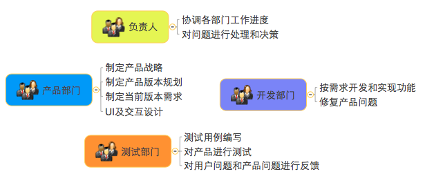
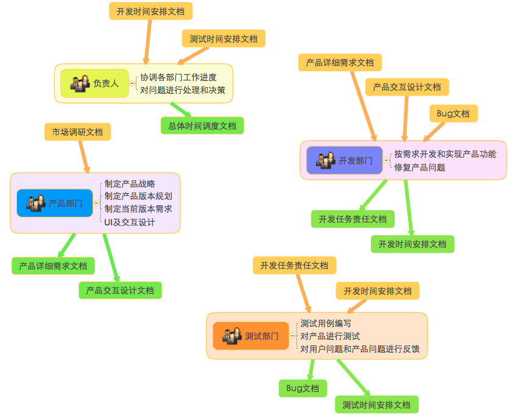
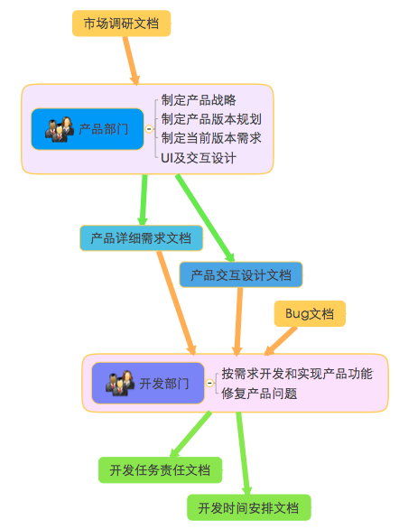

下面所写的完全是遇到了一些问题后混在脑子里的一些念头组合的产物，比较野路子，随意看看即可。

##中心化协作方式
公司是一个50人以下的互联网创业小团队，但是麻雀虽小，五脏俱全，部门划分的还是比较清晰的：产品部门、开发部门、测试部门、推广部门等等。人不多，管理的方式则是由一两个负责人来盯着方方面面，从产品到开发，到测试，到推广等等。在这方方面面的工作中，负责人会制定出一套工作流程来设计各个部门的工作内容，并在其中进行协调和调度。我的理解，这就是一种典型的中心化的协作方式，负责人就是中心，负责人参与到工作的方方面面，不同部门需要对负责人进行汇报，负责人则作为主要动力推动不同部门的工作进展。

具体来说，拿做一个产品来说，负责人会组织产品部门进行产品战略、产品版本规划、当前版本需求的制定，在当前版本的需求、设计、交互等工作完成后，则由负责人协调将工作推动到开发部门进行功能划分、任务划分、时间安排等等，开发工作完成到某一进度时，则再由负责人协调将工作推动到测试部门...

##问题来了
在上述的这种中心化协作的这个过程中，你可能会发现这样一个现象：`大部分的沟通是各部门对负责人的汇报和负责人对各部门的安排；大部分工作的推动力来自负责人向各部门的PUSH。`

那么问题就来了：

- 1）`负责人的沟通负载太大。`负责人成为了一个信息中心，如果这个信息中心主要是处理各部门工作进度控制和协调的相关信息，问题不大，但是如果作为各部门工作内容的一个桥接，那么他在这个沟通过程中处理的信息量就偏大了，所以会变得负载太重，效率太低。并且，负责人的掌控欲望使得他想要去参与方方面面的工作，但事实上他不可能对每项工作都精通。
- 2）`部门间的沟通链条太长。`负责人的桥接角色实际上加长了不同部门的沟通链条，本来从A部门到B部门的直接沟通，变成了A部门到负责人再到B部门的沟通，效率会大大降低。
- 3）`负责人的推动负载太大。`大部分工作的推动力来自负责人，则造成负责人的负载太大，压力更大，而且这样会让整个工作流程的推动力变得太脆弱，万一有时候负责人无暇推动呢。
- 4）`部门的内在驱动力太弱。`各部门的工作都是被指派、被推动，那么内在的驱动力就会变弱，有时候则是疲于应付。

##去中心化协作方式
我所想表达的去中心化的主要思路其实就是：`「充分降权，角色专注」`，即让每一个角色从不需要他的工作流程中退出，减少和缩短沟通链条，降低沟通成本，提高效率；让每个角色专注于他该做的工作上，成为自己的中心，产生内在的驱动力。

###定义角色
去中心化的第一步就是需要在「充分降权，角色专注」的思路下定义好每个部门的角色及其核心的工作内容。比如：产品部门这个角色的核心工作内容包括：制定产品战略、制定产品版本规划、制定当前版本需求、UI及交互设计等；开发部门这个角色的核心工作内容包括：按需求开发和实现功能、修复产品问题等；测试部门这个角色的核心工作内容包括：测试用例编写、对产品进行测试、对用户问题和产品问题进行反馈等；回到负责人这个角色，那他的核心工作内容其实就是协调各部门的工作进度安排、在出现问题的时候进行决策等等，而不是他这插一棍子那打一竿子，又是跟产品讨论需求，又是跟测试商量bug该谁解决。

这样下来，我们甚至可以感觉到负责人跟产品部门、开发部门这些角色都是平等的，各尽其职就好了。

###定义输入和输出接口
定义好了每个部门的角色后，那么接下来就是要看看每个部门与其他部门的依赖关系，并为这种依赖关系定义清晰的接口。简单来说就是定义每个部门依赖的输入和对外的输出。这个输入和输出可以承载为某种形式，比如最常见的文档，举个例子：产品部门输出给开发部门详细的需求文档，那么产品部门就需要在工作中将产品的定义、功能都详细地逐条描述出来组织成需求文档，开发部门则接收需求文档后需要对照着进行任务分配和开发等等。

重要的是对于这个输入和输出的设定要遵循一定的原则：

- `「输入最大利己化，输出最大利他化。」`也就是说，你的工作依赖于其他某个部门的输入时，则要尽力去让输入方提供最能方便你工作的输入；你的工作需要向某个部门输出时，则要尽力提供让接收方能最方便工作的输出（当然，你太懒了不尽力，他也会PUSH你去提供，因为他会要求「输入最大利己化」）。
- `「直接对接，减少跨越。」`也就是说，你的工作依赖于某个角色部门，那么直接跟这个部门去对接工作，减少不必要的跨越。比如：测试部门测试产品时出现了问题，那么应该直接对接开发部门去解决，而不必要去找产品部门反馈，再由产品部门去驱动开发部门解决。当然，能达到这种效果的前提是，上游的工作能够尽量完善，比如测试部门已经能够完整地理解产品定义和产品需求了。这也说明了上一条原则的重要性，你接收的输入能否最大程度地方便你完成你的工作。

为什么要有这样的原则，我的观点是：

- 首先，输入最大利己化能让自己接受输入后最舒服地开展工作，提高效率；
- 其次，输出方一般处在一个工作流的上游，上游的工作如果能做得更细致，通常可以更早地规避问题和风险。如果上游工作图简单，不费心，当下游的工作出了问题，那修正过程一般会有一个回溯的过程，这样成本可就高了。
- 最后，直接对接，减少跨越的目的很明显，就是降低沟通成本，提高沟通效率。

画个不太专业的结构图，大概是像这样：

当把各部门的接口对接起来，拿产品部门和开发部门为例，大概是像这样：

###驱动力
定义好每个部门的角色以及对应的输入输出接口后，可以说每个部门自己其实成为了一个信息处理中心，他需要接收上游部门的输入，并向下游部门提供输出，在接收输入的时候，他为了自己的工作进展的更顺利，他会尽力要求上游部门提供方便自己的输入，而下游部门又会要求自己提供尽量方便他们的输出，这产生了一种自下向上的拉动力。

为了提高效率，每个部门都需要缩短和减少沟通链条，降低沟通成本。只有在去掉中心，充分降权后，才能达到这样的效果。这样也许能够唤起每个部门内在的主动性，让他们自己去驱动自己。

###成长
那么当公司逐渐成长，人员越来越多后，这样的协作方式会长成什么样呢？我觉得可能会是这样的：

- `自由组装。`每种角色的部门可能会有多个，如果要完成一个产品的工作流程，那么可以自由组装和连接各个部门直到产生一条完整的产品生产链条。
- `竞争驱动自我进化。`由于可以自由组装和连接，那么就会产生竞争，做的好的部门会对其他合作部门的吸引力更大，这种吸引力通常会来自这个部门的接口能力更优秀、这个部门的内部处理能力更优秀。吸引力更大的部门当然生命里就更强大。这样便能促使处在同样角色的部门互相学习进化：对外升级输入输出接口，对内改进工作流程。
- `流程自动化。`当团队成长，如果这一套协作流程能够online自动化，那是不是就更好玩了呢？

当然，这个流程在不同的实践过程中会遇到各种不同的问题，这些都是正常的，但是只要坚持一种理念，我相信总能找到与之相符的解决方案。

[SamirChen]: http://samirchen.com "SamirChen"
[1]: {{ page.url }} ({{ page.title }})
[2]: http://samirchen.com/decentralized-cooperation/
