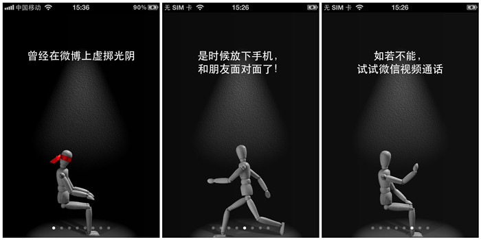

在知乎上看到一个问题[怎么才能让自己发自内心地喜欢自己？][3]以及高票的回答，里面有几个挺有意思的提法：

1. 一切喜欢自己的来源只有一个：可掌控的感觉，能够掌控自己的一切的感觉。
2. 帮助自己建立「掌控」这种感觉最核心的原则是：思考每一件事情的位置，然后让一切回到它应有的位置上去。

上面是答主基于对人性的思考而做出的回答。

换个角度，其实做产品也是如此：让人喜欢的产品，是能让用户获得掌控感的产品，同时也能通过产品提供的服务帮助用户把事情回归到它应有的位置，而不是拽着用户沉溺其中。所以，在产品中要保持克制。这里不得不再赞一赞微信，赞一下它对朋友圈信息流的克制，以及在不断的版本更新中对新增功能的克制。这种克制从另一角度来看，就是在尽量减少对用户的噪音干扰，让用户可掌控。

甚至，在微信的多个版本更新的欢迎页面都似乎在传达着这样一种克制的信息：比如之前 4.2 版本里的欢迎页面的 slogan 是「曾经在微博上虚掷光阴。是时候放下手机，和朋友们面对面了！如若不能，试试微信视频通话。」；又比如在最新的 6.1 版本的欢迎页面的 slogan 是「点赞容易，当面夸太难」。这都是在传达出一种让社交回归社交该有的方式的情怀。这种逼格，不管是真的，还是装的，挺招人喜欢的。

[SamirChen]: http://samirchen.com "SamirChen"
[1]: {{ page.url }} ({{ page.title }})
[2]: http://samirchen.com/self-identity-to-product-identity/
[3]: http://www.zhihu.com/question/23746259/answer/25611380