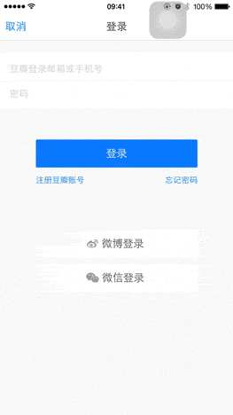
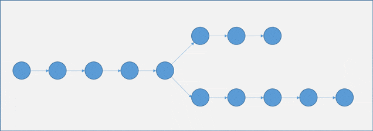

登录界面是很多产品展现给用户的第一个交互界面，想起来，其实不过就是几个输入框、几个按钮的事，很简单，但是最近看了几个 App 的登录界面后，觉得这简单的元素背后其实还是有点东西可以说说的。

##几个例子
随手挑了几个常用 App，试了试它们的登录界面：

上面是豆瓣的登录界面，当账户或密码还没输入内容的时候，登录按钮也是可点击的；点击后通过提示信息告诉用户输入的账户或密码是否符合要求。

上面是微信的登录界面，当账户或密码没有输入内容的时候，登录按钮是不可点击的；当账户和密码框都有内容时，登录按钮变成可以点击的；如果登录信息有误，则通过提示信息告诉用户。

对比上面豆瓣和微信的登录界面，我更赞同微信的做法，即只有当用户输入了账户和密码后才把登录按钮设置为可点击，而且我觉得还可以再改进一下：从「不可点击」到「可点击」状态切换的时候，能够有一些动画效果，而不是突变的。我随手拖了个简单的登录界面出来，实现了状态切换时简单的渐变动画效果，如下：

是不是感觉好点呢？

有人看到这里，可能会说，搞了半天就这么点破事，也没说出来个什么有意思的东西啊？确实，上面讲的就两句话的事：

- 当用户未输入账户或密码时，disable 登录按钮；当用户输入了账户和密码后，才 enable 登录按钮。
- 登录按钮从 disabled 到 enabled 状态切换的时候，用动画效果加以展示。

既然简单，那不妨提几个问题：

- 既然用户输入了账户和密码时才 enable 登录按钮，那假如用户输入的账户或密码不符合格式要求呢，比如：账户不符合邮箱格式或手机号码格式，那么要不要等用户输入了符合格式规范的账户和密码时再 enable 按钮呢？
- 用户未输入账户和密码到用户完成输入是两个状态，那么对应着登录按钮的 disabled 状态和 enabled 状态，这样做可以更好的引导用户一步一步进行操作，那么更细化一点会不会更好呢？比如：先显示账户输入框，当用户输入账户时，再显示密码输入框，当用户输入密码时，才显示登录按钮。
- 为什么要在登录按钮从 disabled 到 enabled 时加动画效果呢？

现在有没有感觉不一样了呢？没想到简简单单一个登录界面背后能采用的方案不是那么显而易见吧？先说说我对于上面几个问题的选择：

- 我不倾向于等用户输入了符合格式规范的账户和密码后再 enable 登录按钮。因为用户很有可能在输入的时候并不会意识到自己输入的账户或密码的格式是不是对的，当他输入了账户和密码后，他只会困惑为什么登录按钮还不能点击，并猜测这是一个 bug。这比用户意识到「没输入账户或密码，所以按钮不能点击」的难度要大得多，所以它应该属于逻辑链的下一环。所以要先解决不输入账户或密码，不能点击登录的事情，再解决输入账户或密码错误，不能登录的事情，通常在这一环，会通过提示用户相关错误信息来解决。
- 针对登录界面这种信息量较少的画面，我不倾向于过于细化的一步步的显示文本框和登录按钮。对信息量过多的处理过程进行分步引导是一个很好的手段，但是对于登录界面这种信息量，即使全部呈现出来，用户也完全能一眼处理完信息并意识到这个界面的目的，就不需要过度细化了。
- 逻辑链条上从一个状态到另一个状态的变化过程越平滑，体验就越好。动画效果就是手段之一。

好了，拿着几个文本框和几个按钮的登录界面扯了这么多，我想说的东西其实就是两点：「逻辑的衔接」和「画面的负荷」。

##逻辑的衔接

一个功能的处理过程通常就是一根逻辑链条，在这个链条上会根据产品的设计分布着一个接一个的状态节点，从一个节点跳到下一个节点的过程该如何衔接是一个值得思考的问题。几个参考建议：

- 在处理过程中，以当前的逻辑节点为目标进行内容呈现，同时在不打扰当前主画面展现的前提下，漏出一些下一个节点的痕迹。
- 在当前逻辑节点向前进展的过程中，下一个节点的痕迹逐渐放大，并在状态转换之际去吸引用户的注意力，指引用户前行的方向。
- 从一个逻辑节点到下一个逻辑节点的变化过程越平滑，体验就越好。合理的动画效果就是手段之一。

##画面的负荷

逻辑的链条形成后便是以一幅幅画面展现给用户，至于在每个画面框住哪几个节点则是根据情况而定。几个参考建议：

- 每一个展现给用户的画面都是有一定的负荷值的，这个负荷值如何选择是需要根据用户的信息处理能力来平衡，我觉得画面的负荷值与用户的体验之间是一个倒 U 曲线的关系。
- 当画面的负荷值太低，那么画面的数量就会增加，而每个画面的目的就变得太微小，使得展示逻辑链条的过程变得拖沓。
- 当画面的负荷值太高，那么画面的内容又会太满、太乱，容易让用户失去焦点感到迷茫。
- 画面负荷值的平衡点是让整个画面展示的内容能让用户一眼就处理得过来，并给出一个用户能轻松接收的目的。
- 选好了画面负荷值后，便意味着一个画面的整体信息传达目标确定，接着便是需要设计局部的注意力吸引的地方，引导用户一步一步的走完过程，抵达目标，这其中便需要结合上面提到的逻辑的衔接的建议了。

[SamirChen]: http://samirchen.com "SamirChen"
[1]: {{ page.url }} ({{ page.title }})
[2]: http://samirchen.com/some-thoughts-from-login-interface/