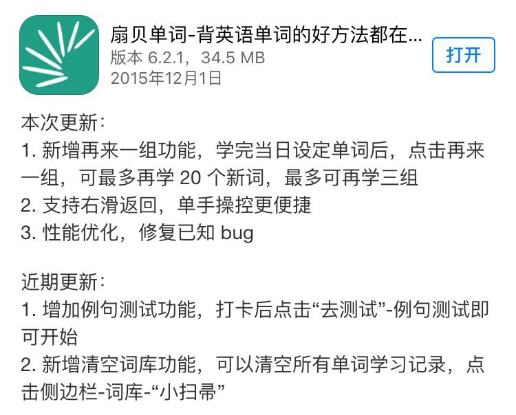
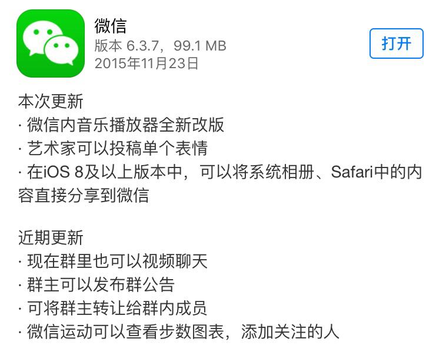

应用更新信息是每次你在 AppStore 里更新 App 时，点开「新功能」才能看到的那几行小字。我也不知道从什么时候养成的习惯，喜欢一个个看看这些更新信息。看多了后，总结起来大概有这样几种样式：

「霸屏型」

屏幕有多大，我就能占多大。

「自嗨型」

姑娘，你这说的这是哪国语言？

「修 Bug 型」

哦。

「Google 翻译型」

施主，何必呢？其实我懂一点英语的。哦，I say I understand a little English!

不过，也有看起来感觉不错的。看看这个：

还有这个：

说实在的，应用更新信息其实就是一件「小事」，你可以认为它没那么重要：「又没什么人看」。不过，你也可以这样想：「事小，要做好也花不了多大成本」。所以，好好写写不费电的。看得人再少，也还是有人看的嘛。如果你也这样想，这里有几条建议也许有用：

- **更新信息分为两部分：`本次更新内容`和`近期更新内容`。**前者挑选 3 条左右本次更新的重要功能点，表明亮点；后者挑选 3 条左右近期更新的重要功能点，照顾那些以前没看到，凑巧这次点开了更新信息的用户（没准他还不知道那些功能呢）。
- **内容有序。**信息最好处理成短句，1、2、3 条地逐一列出。这样清晰明快，给人的第一印象会是「阅读成本很小」，所以就不妨一读了，这下新功能自然介绍出去了。
- **内容简短。**当你点开更新信息时，第一视觉感受是信息的长短。一大屏密密麻麻的字，给人的第一印象就是「读起来要花好多时间」，本来就没有很强的动力要读，所以干脆不读了，白费你写了那么多。就算你确实更新了很多东西，还是取舍一下，选 3 条足矣。
- **书面化表达。**不要太过激情澎湃，动不动就「尼玛」、「有木有」，还夹杂着各种表情，把人眼睛都看花了还不知道你想说啥。另外，Perter 这种梗第一次用后就注定失效了，再说了，你家产品狗把程序猿逼的吐血的事跟我有毛关系啊，你写这里是几个意思？说人话！

总之，节制、不自嗨，再多点用户同理心，应该能写好。

