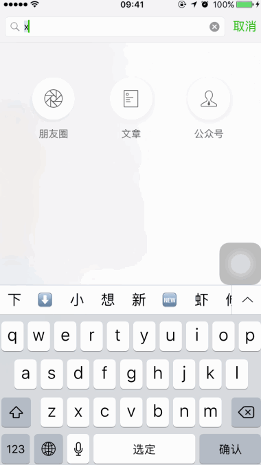
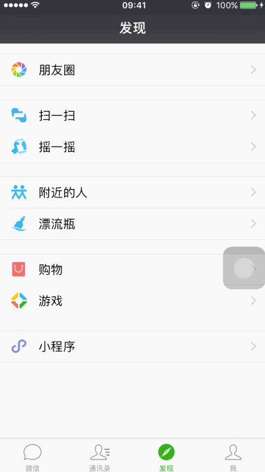
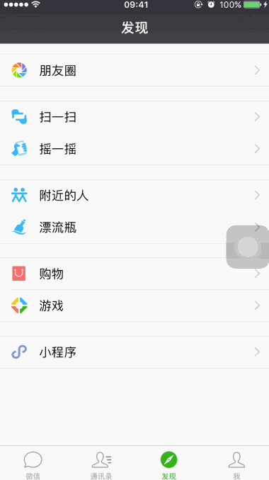
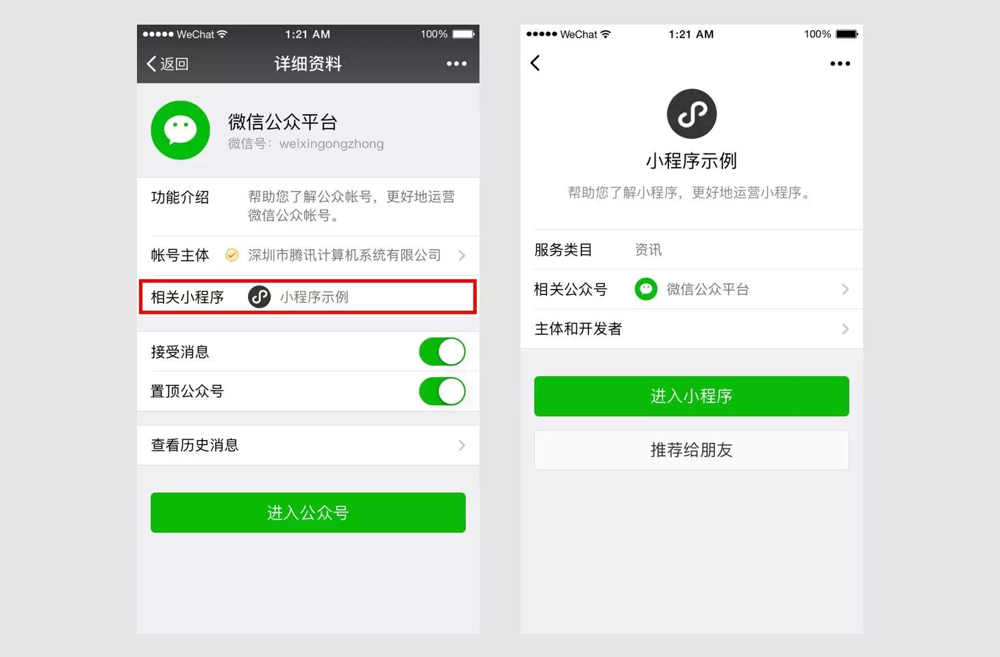
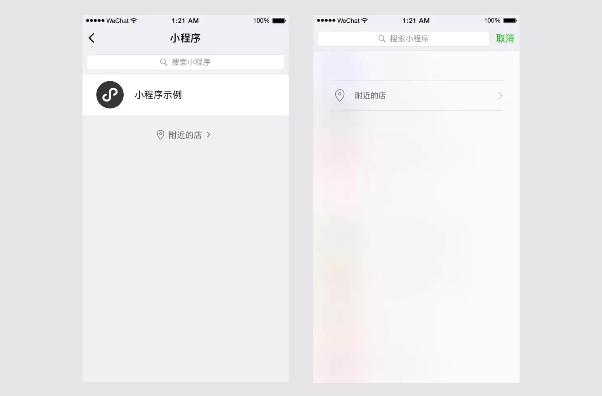

今天微信小程序正式上线了，体验了一把，遇到了些问题，可能你也会遇到。

## 入口在哪里？

想体验微信小程序，第一个问题就是找不到入口。你可以这样做：

1. 进入微信搜索页面，搜索「小程序示例」，这时在搜索结果中的「小程序」栏目，就有「小程序示例」这个官方小程序的入口。
2. 点击「小程序示例」，即可进入体验这个示例小程序。
3. 回到「发现」页面，你就可以看到「小程序」的入口了。

话说回来，这里所谓的「入口」其实是你使用过的小程序的历史记录。张小龙说过，小程序是没有入口的，是去中心化的。

不过也有传言说：当初小程序本来是要叫「应用号」的，不过苹果不让叫。那么，如果你做一个小程序市场当入口，你让苹果怎么想？不过这都是传言啦，大家自己判断就好。但小程序的去中心化理念，确实是与微信一直以来的产品策略相符的，之前的订阅号、企业号都是如此。

## 怎么找到其他小程序？

体验中，遇到的第二个问题就是找不到其他小程序。因为你顺着上面的思路，继续在微信的搜索页面搜索是搜不到的。

这时候，你需要通过刚才激活的小程序入口，进入小程序页面来搜索才行。

不过，这里对小程序的模糊搜索支持有限，比如你搜「滴滴」可以搜到「滴滴出行DiDi」小程序，但是你搜「滴滴打车」就什么都搜不到。大部分情况你得用完整的全名来搜索小程序。

## 微信主体功能与小程序如何切换？

微信成了一个小程序的容器，那必然会遇到一个问题：主体功能和小程序功能在使用时如何切换？

就比如，我正用滴滴出行的小程序打着车呢，这时来了条微信，我需要回复。怎么办？

微信是为小程序提供了一个「显示在聊天顶部」的功能来解决这个问题。你使用这个功能切回微信主界面时，能同时保持住当前使用的小程序的上下文状态和回去的入口，从而做到了微信主体功能和小程序的正常切换。

值得注意的是，我在第一次使用这个功能时，我还以为这是一个「置顶」功能，以方便用户把常用的小程序放置到聊天页面。然而，并不是这样。当你杀掉微信进程，重新进入时，你会发现这个入口消失了。另外，你只能保持一个小程序「显示在聊天顶部」。

## 小程序的体验如何？

我试用了接近 20 多款小程序，运行体验给我的感觉是接近 Native 的体验，目前微信为小程序提供了基础的 UI 组件以及常用的 Native 能力，比如：音视频录制和播放、地图、地理位置、重力感应、罗盘数据、网络状态、电话、扫码、动画、账号、支付等等。这些能力对于一些的小型 App 来说，完全足够了。

这样的趋势将带来什么呢？

这样一来，一些低频应用和功能简单的应用完全可以被卸载掉，转到微信小程序上来。有些人说，那我不做小程序。哈哈。

我默默为支付宝捏把汗，以往那些还有选择支付方式的应用，到小程序这里，就自然而然的直接走微信支付了。

...

## 小程序如何传播？

小程序的传播渠道是受到了很大的限制的。

- 分享：小程序只能分享给微信好友或微信群，不能分享到朋友圈。
- 搜索：在微信的主搜索页面，你能搜到使用过的小程序，但是搜不到其他未使用过的小程序。要搜未使用过的小程序，那就照上面说的，去小程序页面搜索。
- 二维码：只能通过摄像头扫码才能进入小程序，通过图片识别二维码则无法进入小程序。
- 公众号关联：同一个主体的小程序和公众号可以进行关联，并相互跳转。一个公众号可以绑定五个小程序，但一个小程序只能被一个公众号绑定。

- 地址位置：将来，你可以通过「发现-小程序-附近的店」来找到附近的小程序。

[SamirChen]: http://www.samirchen.com "SamirChen"
[1]: {{ page.url }} ({{ page.title }})
[2]: http://samirchen.com/wechat-little-program/
