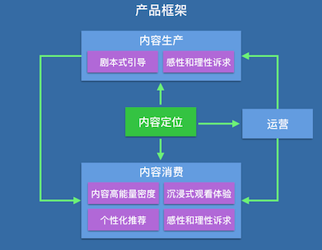

抖音，一款音乐短视频应用，大家应该都知道，就不多介绍背景知识了。作为一个抖音中毒患者，这里从自己的使用体验上聊聊抖音。

## 产品框架

我基于 iOS 1.7.6 版本，简要地画了一下抖音的产品框架，其中分别用蓝色和绿色背景着重用标出了「内容展示」和「内容创作」相关的页面。

## 内容消费

### 内容铺展

从产品框架上来看，可以发现抖音中提供的内容形式大致可以分为这样几类：

- `即时性和短期时效性的内容`：主页顶栏的当前直播与故事。其中，直播是即时性内容；故事是自发布 24 小时内对用户可见的短期时效性内容。
- `基于个性化推荐算法的内容`：主页推荐 Segment。
- `基于地理位置的内容`：主页附近 Segment。
- `根据页面场景过滤的内容`：
	- 搜索页面热门列表，由「挑战」和「音乐」过滤出来的固定数量（8 个）的视频集。
	- 关注页面，由「关注的创作者」过滤出的视频集。
	- 我的页面，由「我点过赞」过滤出的视频集。
	- 挑战详情页面，由「挑战」过滤出的视频集。
	- 音乐详情页面，由「音乐」过滤出的视频集。
	- 用户个人页面，由「该用户创作」过滤出的视频集，由「该用户点过赞」过滤出的视频集。

### 内容时长

抖音的视频内容长度分为两种：

- 15 秒，普通用户只能拍摄不超过 15 秒的视频。
- 1 分钟，高质量创作者可以拍摄不超过 1 分钟的视频。

### 内容观感

1）全屏

首页一进来就直接是全屏视频自动开播，不绕弯子，直奔主题。

大部分内容都是竖屏全屏铺满的，这样的视觉体验最佳，提供了沉浸式观看体验。

在内容的呈现上，一般来说，横屏强调叙事，竖屏强调自我表达。

2）美颜和滤镜

美颜和滤镜是现在各种短视频拍摄工具的标配。提升拍摄者的颜值和画面美感，是提升视频内容质量的重要手段。

抖音的滤镜针对其音乐短视频的定位，做的还是挺炫酷的。

<!-- 补充滤镜视频 -->

3）音乐

抖音里视频的背景音乐大多是节奏感很强的音乐。这里有一个[抖音短视频 BGM 全收录][3]，大家可以听听试试。排在前面的音乐基本上都有鲜明的鼓点节奏。

音乐本身其实就很像是一种「剧本」，当你听到有着鲜明节奏感的音乐，身体的本能就会告诉你该干什么。

4）内容类别

抖音在刚开始时，内容形式相对还是比较同质化的，主要是美女帅哥 + 动感音乐 + 酷炫滤镜 + 舞蹈秀 + 技巧流运镜等等。但也许正是这种垂直的范围较窄的内容区间，很大程度上突出了抖音的内容特点，从而很快打出了这个应用的调性。这种垂直的定位，加上刻意的运营引导，从实际效果来看，起到了很好的启动效果。

不过，随着用户规模扩大，为了覆盖更多的用户，抖音的内容也朝着多元化的方向发展。下图是 2018-04-03 抖音营销峰会上，官方列的一张抖音内容生态的图，仅供参考。

5）内容个性化

通过推荐算法对用户的内容流进行干预，根据用户的观看行为预测用户感兴趣的内容类型并做对应的个性化推荐。

这个应该是现在信息流产品的标配，而今日头条更是以此为豪，这里不必多说。

6）其他视觉

在用户观看视频时，会隐藏系统 Status Bar，不显示时间。

对于 15s 的短视频，不显示进度条，也不显示播放时间；对于 1 分钟的短视频，显示进度条，但不显示播放时间。

这样的设计让用户刷着刷着就忘记了时间，这就是所谓的中毒。

### 小结

#### 内容的高能量密度

要去评价抖音的内容为什么能够如此具有吸引力，从上面列出的这些点来看，其实维度很多，但是可以用一个词来抽象概括：「内容的高能量密度」。

何为内容能量密度？简单来说就是内容单位时间给用户的视听冲击。

美女帅哥、酷炫滤镜、强节奏感音乐等等元素在 15 秒的短时长内呈现给用户，使得内容的能量密度很高，给用户的感官刺激很强。而内容时长较短，又能促使用户快速消费，快速切换，就像在一针又一针给用户打药，嗨的就忘了时间了。

而后来抖音又增加了 1 分钟时长形式，但是只是逐步放开给高质量的创作者，一方面应该是考虑内容的多元化发展，另一方面则应该是考虑到优秀的创作者会更有能力保持内容的能量密度。

#### 沉浸式的观看体验

另外一个吸引用户的地方在于「沉浸式的观看体验」。内容全屏展示、隐藏 Status Bar、不显示播放时间和进度、上滑轻松切换内容、播放秒开无黑屏等等一起做到了让用户更加沉浸于内容、忘时中毒。

#### 内容推荐算法

内容推荐算法是今日头条引以为豪的技术领域，在抖音的主要内容流里必然受到推荐算法的影响。

在我看来，有些类型的内容，它的高能量密度是普遍有效的，比如抖音在产品探索期所充斥的美女帅哥 + 动感音乐 + 舞蹈秀的内容。

而有些类型的内容，它的高能量密度是个性化的，就比如篮球爱好者看到运动员大力扣篮、晃翻对手的内容；再比如吃鸡爱好者看到玩家单局 20 杀，大吉大利，晚上吃鸡的内容。

对于高能量密度普遍有效的内容，把其作为内容定位，在产品探索期是吸引用户的有效手段。

对于高能量密度个性化的内容，则是在产品成长期进行扩张的手段，这时推荐算法就有着广阔的发挥空间。

但是，反向来看，有些类型的内容，它的低能量密度也是普遍有效的，绝大部分人看到这样的内容都会觉得没啥意思。所以控制内容的高能量密度还是重中之重，无非是普遍性还是个性化的问题。

## 内容生产

### 创作入口

从产品框架上来看，抖音中的内容创作入口有这些：

- `首页的故事拍摄入口`：点击进入故事创作页面。
- `创作 Tab`：点击进入音乐选择页面，开始自发性创作。
- `挑战详情页面的参与按钮`：点击进入音乐选择页面。值得一提的是，除了通过产品内固有锚点进入挑战详情页面之外，抖音小助手会通过推送消息来不断推出各种新的挑战去引导用户参与挑战。
- `音乐详情页面的拍同款按钮`：点击进入拍摄短视频页面。
- `音乐选择页面的尬舞机按钮`：点击音乐选择页面的尬舞机进入。

### 创作方式

从创作入口也可以总结出抖音所引导的创作方式包括：

- `故事`，这是一种短期时效性内容的自由创作，关注者 24 小时内可见，强调的 VLog 的概念，记录自己的生活。
- `挑战`，这是一种有示范、非强制性的剧本式创作，剧本依据挑战描述而定，同时搭配了示范视频。
- `音乐同款`，这是一种使用同款背景音乐的创作，同样的搭配了示范视频。其实背景音乐也是一种剧本，当你听到有着鲜明节奏感的音乐，身体的本能就会告诉你该干点啥。
- `尬舞机`，通过动作识别来引导跳舞的剧本式创作。

### 创作功能

创作流程提供的创作功能是为了帮助用户更方面地创作符合产品内容定位的作品：

- `美颜`，标配，提升创作者颜值，给用户更好的观感。
- `滤镜`，标配，提升视频画面美感。
- `特效`，包含滤镜特效和时间特效。炫酷的抖音特效能很好的跟音乐元素结合，形成良好的视听感受，使得生产出的内容相对于其他产品有很好的辨识度。
- `道具`，各种道具就像是一个工具箱，用的好不好就看创作者的能耐了。这个能力属于锦上添花，从我自己看到的抖音内容来看，包含道具的比例还比较低。
- `音乐剪辑功能`，作为一个音乐短视频的定位，这个能力自然必不可少。它能让我们的短视频的背景音乐直接从高潮开始。
- `倍速调节`，标配，压缩或拉伸内容的相对时间，帮助拍摄时更好地配合音乐节奏。
- `倒计时`，可以根据音乐播放位置设置自动暂停，从而帮助创作者更好地卡节拍。这是基于内容定位而推出的特定功能。
- `可以移动的按住拍按钮`，这是一个小细节，抖音的按住拍按钮是可以移动的，这个在运镜拍摄时可以方便创作者暂停。

### 小结

#### 内容定位为纲

从上面的分析中不难看出，在创作链路上，抖音提供的各种创作入口、创作方式、创作功能，以及运营不断筛选推送的各种挑战，都是紧紧围绕着自身的内容定位而展开的。

据说，抖音甚至还会为用户发放「抖音气囊手机壳」来帮助他们更好地完成运镜等技巧的拍摄。

创作工具哪些功能优先级高、哪些功能优先级低，运营推荐哪些视频、推送什么样的挑战、组织什么形式的线下活动等等都依据不同阶段的不同内容定位而动。

#### 剧本式引导

上面也讲过了，在我看来，其实挑战、音乐同款、尬舞机都是剧本式引导。

剧本式引导是保证内容质量的一种手段，如果控制得当，它会引导创作者生产出大量符合水准的内容，在产品探索期可以帮助确定产品特色，打出产品调性。

但是，也有个问题，剧本式引导带来大量的同质化内容，从长期来看可能导致用户审美疲劳，失去新鲜感。好在目前尚可通过扩展挑战内容和音乐类型来扩展内容类型的宽度，这种扩展在内容分发端则需要配合推荐算法来对内容的能量密度进行个性化细分，否则也可能留不住老用户又拉不来新用户。

## 产品参与者

### 创作者

创作者在抖音里可以获得什么：

- 感性上，自我表达
- 感性上，从外界获得认同感、成就感、荣誉感
- 理性上，获得影响力
- 理性上，获得经济利益（广告、导购、打赏等等）

对创作者的感性和理性诉求的满足主要与这些功能或数据相关：观看量、点赞量、转发量、评论量、评论内容、粉丝量、直播权限、1 分钟视频权限、导购功能权限等等。

### 观看者

观看者可以在抖音里获得什么：

- 感性上，享受视听体验
- 理性上，获得知识技巧

对观看者的感性和理性诉求的满足，其实主要与内容相关。

## 结论

### 从细节到抽象

为什么要抽象？因为对一个产品的分析，最终应该是去从具体的形态和细节中去抽象出理论，找出归因。因为这些理论才更具有通用价值，而归因才更具有普遍解释性。当然，很多时候可能抽象错了，归因不对。

我们对上面的分析过的一些产品细节进行简化，抽象出产品中的关键概念：

这时候我们可以做这样的描述：在一个「产品框架」上基于产品的「内容定位」去支撑用户完成「内容生产」和「内容消费」的链路，并满足不同角色的感性和理性诉求，而「运营」则通过各种手段来促使这个链路围绕着「内容定位」高效地运作。

这里再列一下几个关键词：

- `内容的高能量密度`
- `沉浸式的观看体验`
- `高能量密度个性化有效内容的个性化推荐`
- `内容定位为纲`
- `剧本式引导`
- `创作者和观看者的感性和理性诉求`

### 从抽象回到细节

从抽象回到细节的过程，是在有效经验的基础上应用创新的过程。

以下举几个例子，抛砖引玉：

1、在「内容定位」上，要解决的问题是：如何寻找高能量密度的内容类型，在内容区间相对较窄的产品探索期，既形成用户口碑，又打出产品调性？

抖音找到了美女帅哥 + 动感音乐 + 舞蹈秀这样高能量密度普遍适用的内容类型。那么，还有其他方向吗？

2、在「产品框架」上，要解决的问题是：如何高效地组织多种维度的内容来覆盖不同的场景和需求？如何提供高效的路径来引导用户创作符合内容定位的作品？如何支撑运营来有效干预和引导内容生产和内容消费的链路？

抖音的产品框架我已经在文章开头就给出来了。那么，还有更加优秀的产品框架吗？

3、在「内容生产」上，要解决的问题是：如何围绕内容定位针对性地提供的创作工具？如何引导创作者围绕内容定位进行创作？

比如抖音中拍摄视频时「倒计时功能」，就是可以根据音乐播放位置设置自动暂停，从而帮助创作者更好地卡节拍的针对性设计。抖音小助手通过不断筛选和推送「挑战」来引导用户剧本式创作的运营方式。那么，还有更好的剧本式创作方式吗？（放一个小例子：在基于话题的剧本式创作时，微视在拍摄时甚至贴上了示范视频让用户直接照着来）

当然，往细节里深入，还会有很多问题，这背后也许会诞生很多的创新和差异化从而让你找到另一条通幽曲径。

此外，在产品迭代的过程中，数据驱动也是行之有效的手段。一个小案例：抖音之前的产品名字叫 A.me，后来改名才叫抖音，在这个改名的过程中，据说团队是脑暴了好几个名字，然后做 ABTest 分发到不同的渠道，再根据下载和更新数据来决定最终的产品名。

<!-- Python 的 jiaba 库分词，导入 wordart 作图 -->

[SamirChen]: http://www.samirchen.com "SamirChen"
[1]: {{ page.url }} ({{ page.title }})
[2]: http://samirchen.com/talk-about-douyin/
[3]: http://music.163.com/#/playlist?id=728438549
